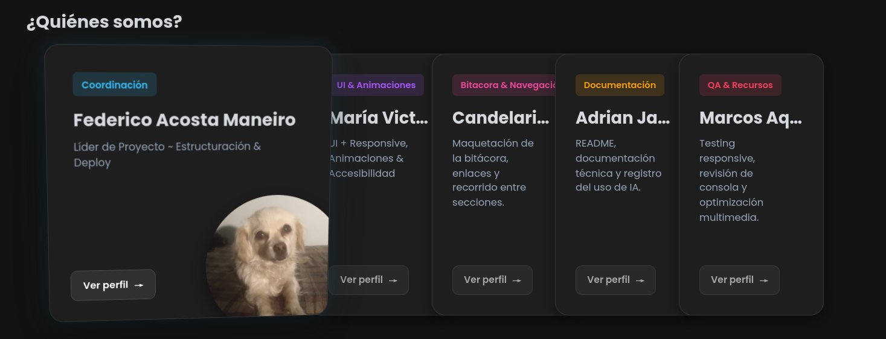
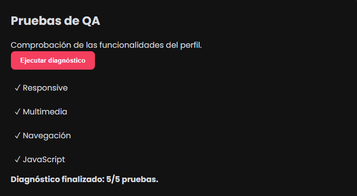
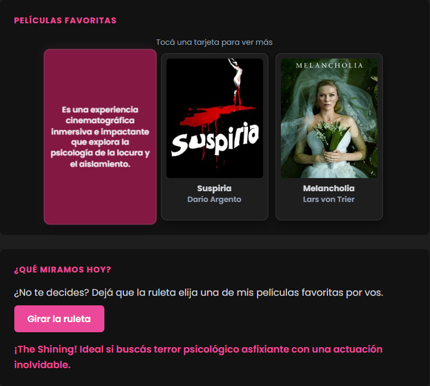
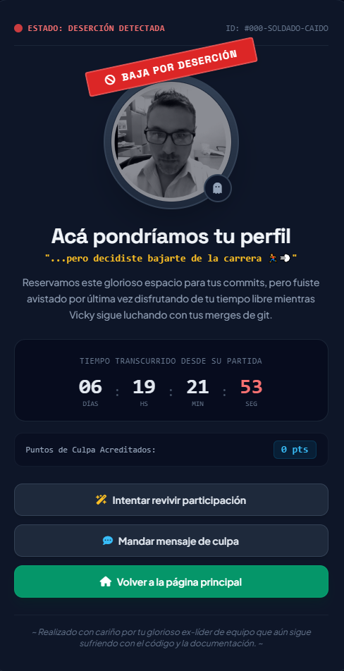

# Equipo 11 ~ TP1 Frontend

Sitio web grupal desarrollado para la materia **Desarrollo de Software Web Frontend**, Comisión A, IFTS Nº 29. Es un portfolio colaborativo donde cada integrante cuenta con una portada común y un perfil individual propio, además de una bitácora que documenta el proceso de trabajo en equipo.

## Índice

- [Equipo 11 ~ TP1 Frontend](#equipo-11--tp1-frontend)
  - [Índice](#índice)
  - [Integrantes](#integrantes)
  - [Tecnologías utilizadas](#tecnologías-utilizadas)
  - [Estructura de archivos y carpetas](#estructura-de-archivos-y-carpetas)
  - [Guía de estilos](#guía-de-estilos)
    - [Paleta de colores global](#paleta-de-colores-global)
    - [Colores de etiqueta por integrante (portada)](#colores-de-etiqueta-por-integrante-portada)
    - [Acentos propios de cada perfil](#acentos-propios-de-cada-perfil)
    - [Google Fonts](#google-fonts)
    - [Iconografía](#iconografía)
  - [Funciones de JavaScript](#funciones-de-javascript)
    - [Portada y global — `main.js`](#portada-y-global--mainjs)
    - [Bitácora — `bitacora.js`](#bitácora--bitacorajs)
    - [Perfil de Fede — `fede_perfil.js`](#perfil-de-fede--fede_perfiljs)
    - [Perfil de Marcos — `marcos_perfil.js`](#perfil-de-marcos--marcos_perfiljs)
    - [Perfil de Cande — `cande_perfil.js`](#perfil-de-cande--cande_perfiljs)
    - [Perfil de Victoria — `victoria_perfil.js`](#perfil-de-victoria--victoria_perfiljs)
    - [Perfil de broma — script inline en `perfil_adrian.html`](#perfil-de-broma--script-inline-en-perfil_adrianhtml)
  - [Documentación técnica ampliada](#documentación-técnica-ampliada)
  - [Cómo ejecutar el proyecto en local](#cómo-ejecutar-el-proyecto-en-local)
  - [Sitio publicado](#sitio-publicado)
  - [Evolución del proyecto](#evolución-del-proyecto)
  - [Uso de Inteligencia Artificial](#uso-de-inteligencia-artificial)

---

## Integrantes

| Integrante | Rol en el proyecto | Perfil de GitHub |
|---|---|---|
| Federico Acosta Maneiro | Estructuración, Documentación & Deploy | [@federicosd06-dev](https://github.com/federicosd06-dev) |
| María Victoria Mariani | UI + Responsive, Animaciones & Accesibilidad | [@mvjhart](https://github.com/mvjhart) |
| Candelaria Chazarreta | Bitácora & Navegación | [@kndxt](https://github.com/kndxt) |
| Marcos Aquino | QA & Recursos | [@Marcos028](https://github.com/Marcos028) |

> Repositorio del grupo: <https://github.com/federicosd06-dev/DSWF_TP1_2A_Grupo11>

## Tecnologías utilizadas

- **HTML5** semántico, con atributos ARIA para accesibilidad.
- **CSS3**: variables (custom properties), Grid, Flexbox, `clamp()` para tipografía fluida, `@media` queries, `:has()`, View Transitions API y anidamiento nativo (usado en `styles_ria.css`).
- **JavaScript** (ES Modules en la bitácora, scripts clásicos en el resto): manipulación del DOM, `localStorage`, `matchMedia`, `requestAnimationFrame`.
- **Google Fonts**: Poppins, Chakra Petch, Share Tech Mono, Plus Jakarta Sans y Space Grotesk.
- **Tailwind CSS** (vía CDN) y **Font Awesome 6.4.0**, usados únicamente en la página especial de Adrian.
- **Git y GitHub** para control de versiones de trabajo colaborativo.
- **Vercel** para el deploy continuo del sitio.
- **Figma** para el diseño previo de las interfaces.

## Estructura de archivos y carpetas

```
DSWF_TP1_2A_Grupo11/
├── index.html                  → Portada con el listado de integrantes
├── bitacora.html                → Bitácora del proyecto (acordeón dinámico)
├── README.md
├── css/
│   ├── styles.css                → Hoja de estilos global (reset, header, footer,
│   │                                portada, bitácora, tema claro/oscuro)
│   ├── styles_fede.css           → Estilos propios del perfil de Fede
│   ├── styles_marcos.css         → Estilos propios del perfil de Marcos
│   ├── styles_knd.css            → Estilos propios del perfil de Cande
│   └── styles_ria.css            → Estilos propios del perfil de Victoria
├── js/
│   ├── main.js                   → Menú móvil, tema y animación 3D de las tarjetas
│   ├── bitacora.js               → Inyección dinámica de la bitácora (acordeón)
│   ├── bitacoraData.js           → Datos de las entradas de la bitácora
│   ├── fede_perfil.js            → Interacciones del perfil de Fede
│   ├── marcos_perfil.js          → Interacciones del perfil de Marcos
│   ├── cande_perfil.js           → Interacciones del perfil de Cande
│   ├── victoria_perfil.js        → Interacciones del perfil de Victoria
│   └── adrian_perfil.js          → Vacío (la lógica de su página está inline)
├── integrantes/
│   ├── perfil_fede.html
│   ├── perfil_marcos.html
│   ├── perfil_cande.html
│   ├── perfil_victoria.html
│   └── perfil_adrian.html
└── img/
    ├── fede/
    ├── itos/                     → Imágenes del perfil de Marcos
    ├── knd/                      → Imágenes del perfil de Cande
    ├── ria/                      → Imágenes del perfil de Victoria
    └── adrian/
```

## Guía de estilos

### Paleta de colores global

| Uso | Variable | Hex (tema claro) | Hex (tema oscuro) |
|---|---|---|---|
| Color primario (header/footer) | `--color-primario` | `#1a252f` | `#121212` |
| Color secundario / acento | `--color-secundario` | `#00adb5` | `#0d9488` |
| Fondo de página | `--color-fondo` | `#f4f6f8` | `#121212` |
| Fondo de tarjeta | `--color-tarjeta` | `#ffffff` | `#1e1e1e` |
| Texto principal | `--color-texto` | `#222831` | `#d6d9de` |
| Texto suave | `--color-texto-suave` | `#555555` | `#94a3b8` |
| Hover | `--color-hover` | `#007f86` | `#0a756b` |

### Colores de etiqueta por integrante (portada)

| Integrante | Variable | Hex |
|---|---|---|
| Fede | `--color-etiqueta-celeste` | `#38bdf8` |
| Victoria | `--color-etiqueta-violeta` | `#a855f7` |
| Cande | `--color-etiqueta-rosa` | `#ec4899` |
| Adrian | `--color-etiqueta-ambar` | `#f59e0b` |
| Marcos | `--color-etiqueta-coral` | `#f43f5e` |

### Acentos propios de cada perfil

| Perfil | Colores | Detalle |
|---|---|---|
| Fede | `#22d3ee` cian · `#ff2a6d` magenta · `#fcee0a` amarillo | Estética cyberpunk, panel oscuro con bordes biselados |
| Victoria | `#a855f7` violeta · chips en `#ef4444`, `#f59e0b`, `#10b981`, `#3b82f6`, `#8b5cf6` | Un color por habilidad |
| Cande | `#ec4899` rosa | Tarjetas flip y dorso en `#831843` |
| Marcos | `#f43f5e` coral | Tarjetas flip de películas y álbumes |
| Adrian | Paleta de Tailwind (slate, amber, red, sky, emerald) | Página especial fuera de la línea gráfica general, como parte humorística |

### Google Fonts

| Fuente | Pesos | Dónde se usa |
|---|---|---|
| Poppins | 300, 400, 600, 700 | Tipografía global del sitio |
| Chakra Petch | 500, 700 | Títulos del perfil de Fede |
| Share Tech Mono | Regular | Texto tipo terminal del perfil de Fede |
| Plus Jakarta Sans | 400, 600, 700, 800 | Página especial de humor |
| Space Grotesk | 500, 700 | Página especial de humor |

### Iconografía

- **Ícono de GitHub**: SVG inline, reutilizado en el footer de todas las páginas.
- **Toggle de tema**: emojis ☀️ (claro) y 🌙 (oscuro).
- **Font Awesome 6.4.0** (vía CDN): usado únicamente en la página de Adrian (íconos de fantasma, calavera, varita, etc.).

## Funciones de JavaScript

### Portada y global — `main.js`

| Función | Qué hace |
|---|---|
| Menú móvil (`menu-toggle`) | Abre y cierra la navegación en pantallas chicas, la cierra al hacer clic en un enlace y la resetea al pasar a escritorio. |
| Cambio de tema (`theme-toggle`) | Alterna entre claro/oscuro, guarda la preferencia en `localStorage` y anima la transición con la View Transitions API (efecto circular desde el botón), respetando `prefers-reduced-motion`. |
| `manejarMovimiento` / `resetearAnimacion` | Efecto 3D de inclinación en las tarjetas de la portada según la posición del mouse; solo se activa con puntero fino, pantalla ≥ 900px y sin movimiento reducido. |



### Bitácora — `bitacora.js`

| Función | Qué hace |
|---|---|
| `renderLog()` | Lee las entradas de `bitacoraData.js` e inyecta dinámicamente el acordeón en `#contenedor-bitacora`; agrega los listeners de clic para expandir/contraer cada entrada, actualizando los atributos ARIA correspondientes. |


### Perfil de Fede — `fede_perfil.js`

| Función | Qué hace |
|---|---|
| Interacción táctil en películas y discos | En dispositivos táctiles, un toque activa el efecto neón/vinilo (que en escritorio se dispara con `:hover`/`:focus-visible`). |
| Mini terminal (`escribir`) | Al presionar el botón, tipea letra por letra un comando simulado (`whoami`, `stack --lista`, `ls discos/`) y cicla entre los tres; con movimiento reducido muestra el texto completo sin animar. |
| Fallback de imágenes | Si un póster o carátula no carga, la quita del DOM para mostrar el degradé de respaldo en vez del ícono de imagen rota. |


### Perfil de Marcos — `marcos_perfil.js`

| Función | Qué hace |
|---|---|
| Flip cards de películas y álbumes | Al hacer clic, gira la tarjeta para mostrar el comentario personal del otro lado. |
| Diagnóstico QA (`btn-diagnostico`) | Inyecta un listado de resultados de prueba (responsive, multimedia, navegación, JavaScript) a modo de demostración. |



### Perfil de Cande — `cande_perfil.js`

| Función | Qué hace |
|---|---|
| `iniciarFlipCards()` | Gira las tarjetas de películas con clic o teclado (Enter/Espacio). |
| Recomendador de películas | Al presionar el botón, resetea las tarjetas, elige una al azar, la gira automáticamente y muestra una reseña asociada. |



### Perfil de Victoria — `victoria_perfil.js`

| Función | Qué hace |
|---|---|
| Pestañas móviles | Alterna entre las secciones de películas y música, solo en pantallas menores a 801px. |
| Interacción táctil en pósters | En dispositivos táctiles, un toque muestra el comentario asociado a cada película o álbum. |
| Interacción táctil en habilidades | Un toque resalta el chip de habilidad seleccionado. |
| Animación de puntos decorativos | Cada punto tiene una fase y velocidad aleatorias, animadas con `requestAnimationFrame`; se detiene si el usuario prefiere menos movimiento. |


### Perfil de broma — script inline en `perfil_adrian.html`

`adrian_perfil.js` está vacío a propósito: toda la lógica de esta página (a modo de broma del equipo) vive en un `<script>` dentro del propio HTML.

| Función | Qué hace |
|---|---|
| Contador de tiempo | Cuenta días, horas, minutos y segundos desde que "abandonó" el equipo. |
| Sistema de toasts | Muestra notificaciones emergentes con distintos íconos y colores. |
| Modales ficticios | "Ritual de resurrección" y "Mandar mensaje de culpa", con barras de progreso simuladas y respuestas aleatorias. |



## Documentación técnica ampliada

Además del resumen anterior, cada integrante escribió una documentación más profunda de su propia parte (objetivo, funcionamiento paso a paso, decisiones de implementación, accesibilidad y evolución con capturas), disponible en la carpeta [`/docs`](./docs):

| Página / perfil | Documento |
| --- | --- |
| Portada (`index.html`, `main.js`) | [`docs/index-funcionalidades.md`](./docs/index-funcionalidades.md) |
| Bitácora (`bitacora.html`) | [`docs/bitacora-funcionalidades.md`](./docs/bitacora-funcionalidades.md) |
| Perfil de Fede | [`docs/documentacion_js_fede.md`](./docs/documentacion_js_fede.md) |
| Perfil de Marcos | [`docs/documentacion_js_marcos.md`](./docs/documentacion_js_marcos.md) |
| Perfil de Cande | [`docs/documentacion_js_cande.md`](./docs/documentacion_js_cande.md) |
| Perfil de Victoria | [`docs/documentacion_js_ria.md`](./docs/documentacion_js_ria.md) |

Esta sección es un plus sobre lo exigido por la consigna: la explicación mínima de cada función ya está en la sección anterior, autocontenida en este README.

## Cómo ejecutar el proyecto en local

1. Cloná el repositorio: `git clone https://github.com/federicosd06-dev/DSWF_TP1_2A_Grupo11.git`
2. Abrí la carpeta en tu editor (recomendado: VS Code).
3. Instalá la extensión **Live Server**.
4. Hacé clic derecho sobre `index.html` → **Open with Live Server**.
5. El sitio se abre en `http://localhost:5500` (o el puerto que uses).

No requiere instalación de dependencias ni build previo: es HTML, CSS y JS planos.

## Sitio publicado

**URL de Vercel:** https://frontend-tp1-grupo11.vercel.app/

## Evolución del proyecto

Ideas y pendientes para las próximas entregas:

- Continuar incorporando nuevas tecnologías y herramientas de desarrollo, con una futura migración progresiva hacia React.
- Mejorar la organización, reutilización y mantenimiento del código a medida que el proyecto evolucione.
- Incorporar validación automática de HTML/CSS antes de cada entrega.

## Uso de Inteligencia Artificial

| Documento específico sobre el uso de la AI | [`docs/AI.md`](./docs/AI.md) |

El equipo utilizó asistencia de IA como apoyo puntual en tareas específicas: los cálculos matemáticos del efecto 3D de las tarjetas de la portada (`main.js`), el diseño de la lógica de persistencia del tema en `localStorage` y la depuración de comportamientos responsive. Todo el código sugerido fue revisado y validado por el equipo antes de integrarlo al repositorio, siguiendo los acuerdos de flujo de trabajo establecidos en la bitácora (evaluación crítica de las respuestas de la IA antes de ejecutar comandos, y consulta al grupo ante cualquier duda antes de alterar el repositorio compartido).

