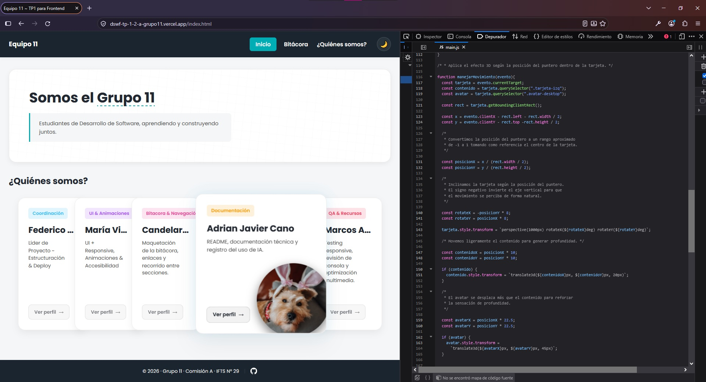
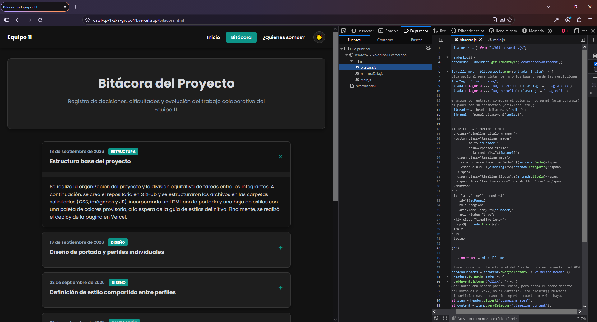
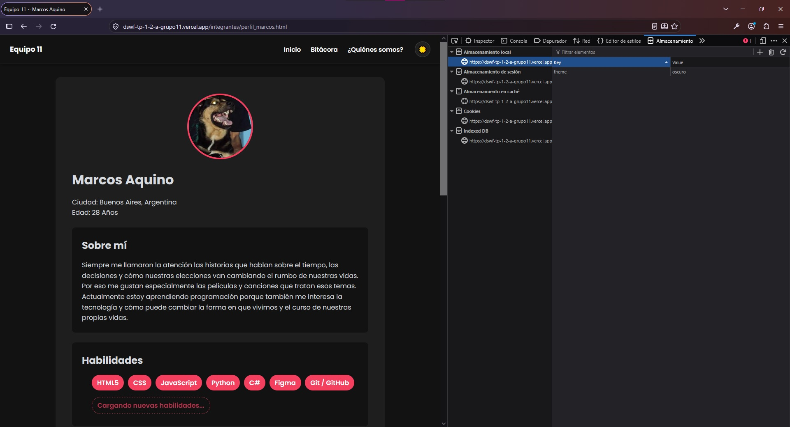
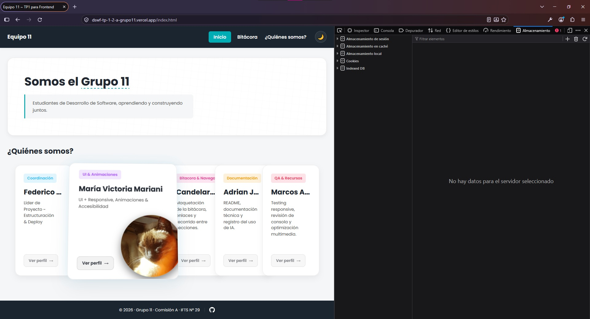

# Equipo 11 - Sitio web grupal

Bienvenidos al sitio web desarrollado para el **Trabajo Práctico Grupal N° 1 de la Materia Desarrollo de Sistemas Web (Front End)** de la
comisión "A" del IFTS N.º 29. El proyecto presenta al Grupo 11 de estudiantes de
Desarrollo de Software mediante una portada común, una página de bitácora y un
perfil individual para cada integrante.

Es una aplicación web estática: no utiliza backend, framework ni sistema de
compilación. Todo el contenido se sirve directamente desde archivos HTML, CSS,
JavaScript e imágenes.

## Link al repositorio Github del proeycto

https://github.com/federicosd06-dev/DSWF_TP1_2A_Grupo11

## Link a deploy del proyecto en Vercel.

https://dswf-tp-1-2-a-grupo11.vercel.app/

## Contenido del sitio

- **Inicio (`index.html`)**: presentación del grupo y tarjetas con los cinco
  integrantes.

- **Bitácora (`bitacora.html`)**: acceso preparado desde la navegación global
  para el registro del proceso del trabajo.

- **Enlace a los perfiles individuales de cada integrante del grupo**:

- **Enlace al perfil de Federico Acosta Maneiro:** https://dswf-tp-1-2-a-grupo11.vercel.app/integrantes/perfil_fede.html

- **Enlace al perfil de Maria Victoria Mariani:** https://dswf-tp-1-2-a-grupo11.vercel.app/integrantes/perfil_victoria.html

- **Enlace al perfil de Candelaria Chazarreta:** https://dswf-tp-1-2-a-grupo11.vercel.app/integrantes/perfil_cande.html

- **Enlace al perfil de Adrian Javier Cano:** https://dswf-tp-1-2-a-grupo11.vercel.app/integrantes/perfil_javier.html

- **Enlace al perfil de Marcos Aquino:** https://dswf-tp-1-2-a-grupo11.vercel.app/integrantes/perfil_marcos.html
 
## Funcionalidades compartidas

- Navegación entre inicio, bitácora y sección “¿Quiénes somos?”.
- Menú hamburguesa para pantallas pequeñas.
- Cambio entre tema claro y oscuro.
- Persistencia del tema elegido mediante `localStorage`.
- Tarjetas del equipo con efecto 3D en dispositivos con puntero preciso.
- Foco visible y controles navegables por teclado.
- Diseño responsive para escritorio, tablet y móvil.

## Tecnologías

* **HTML5:** Marcado semántico estructurado.
* **CSS3:** Variables personalizadas (`:root`), Flexbox, CSS Grid, media queries adaptativas y transiciones fluidas.
* **JavaScript Moderno (ES6+):** Programación imperativa, manipulación del DOM y manejo de eventos sin dependencias de librerías terceras.
* **Tipografías:** Google Fonts (Familia **Poppins**).

## Estructura del proyecto

```text
DSWF_TP1_2A_Grupo11/
├── index.html                   # Portada principal del sitio
├── bitacora.html                # Registro técnico y diario de progreso
├── css/
│   └── styles.css               # Estilos globales, variables de tema y responsive
├── js/
│   ├── main.js                  # Lógica del index (interacciones de tarjetas 3D)
│   ├── theme.js                 # Control común del modo claro/oscuro (Persistencia)
│   └── bitacora.js              # Manejo interactivo de las entradas de bitácora
├── integrantes/
│   ├── perfil_fede.html         # Perfil de Federico
│   ├── perfil_victoria.html     # Perfil de María Victoria
│   ├── perfil_cande.html        # Perfil de Candelaria
│   ├── perfil_javier.html       # Perfil de Adrian Javier
│   └── perfil_marcos.html       # Perfil de Marcos
└── img/                         # Recursos visuales y optimizados locales
```

## Cómo ejecutar el proyecto

1. **Clonar el repositorio:**
   ```bash
   git clone https://github.com.git
   cd DSWF_TP1_2A_Grupo11
   ```

2. **Ejecutar vía Visual Studio Code:**
   * Abrir la carpeta del proyecto en VS Code.
   * Instalar la extensión popular **Live Server**.
   * Hacer clic derecho sobre `index.html` y seleccionar **Open with Live Server**.

3. **Ejecutar alternativa con Python:**
   Si disponés de Python en tu sistema, podés ejecutar en la terminal:
   ```bash
   python -m http.server 8080
   ```
   Luego ingresar en el navegador a `http://localhost:8080`.

## Equipo y responsabilidades

Las responsabilidades mostradas en la portada son:

| Integrante | Área principal |

👤 **Federico Acosta Maneiro:** (Coordinador & Desarrollador Frontend)
- Tareas: Creación del repositorio, Vercel, portada (index.html), rotación JS (main.js) y perfil-1.html.

👤 **María Victoria Mariani:** (Diseño CSS & Responsive Design)
- Tareas: Archivo styles.css global, guía de estilos (colores, Google Fonts) y prueba de breakpoints (400px, 900px, 1200px) + perfil-2.html.

👤 **Candelaria Chazarreta:** (Bitácora & Navegación)
- Tareas: Maquetación y redacción de bitacora.html (decisiones, problemas, soluciones) y verificación de enlaces + perfil-3.html.

👤 **Adrián Javier Cano:** (Documentación README.md & Registro IA)
- Tareas: Redacción del README.md obligatorio (capturas, explicaciones JS, uso de IA, prompts) + perfil-4.html.

👤 **Marcos Aquino:** (QA, Testing & Recursos Multimedia)
- Tareas: Optimización de imágenes en /img, testing de desbordes responsive y consola JS + perfil-5.html.

## Uso de Inteligencia Artificial

Como parte del proceso de aprendizaje, se integró el uso ético y productivo de modelos de IA asistenciales bajo las siguientes directrices:
* **Generación de ideas:** Ayuda en el planteamiento estructural de la persistencia de datos con `localStorage`.
* **Refactorización de código:** Optimización de funciones matemáticas para el cálculo de inclinación 3D de las tarjetas.
* **Depuración:** Resolución de inconsistencias en el acoplamiento del menú hamburguesa en entornos de tablets de 900px de ancho.

# Guía Técnica: Comportamiento JavaScript, Modularización y Evolución

Este apartado detalla el funcionamiento interno de los scripts interactivos del proyecto del **Equipo 11**, explica su integración con los archivos HTML correspondientes y propone la hoja de ruta para las siguientes entregas de la materia.

# Documentación Técnica: JavaScript, Estructura y Evolución - Equipo 11

Este documento explica de forma sencilla cómo funciona el código JavaScript en nuestro sitio web, cómo se conectan los archivos y qué mejoras implementaremos en los próximos trabajos prácticos.


## 🗂️ 1. Explicación de Funciones JavaScript por Sección

### 🏠 Sección: Inicio / Portada (`js/main.js` ➔ Afecta a `index.html`)
* **¿Qué hace?:** Controla el efecto visual en 3D (inclinación) de las tarjetas de presentación de los integrantes cuando pasamos el mouse por encima.
* **Explicación simple:** El script detecta la posición del cursor dentro de la tarjeta y calcula cuántos grados debe inclinarse en los ejes X e Y. Cuando el mouse se retira, la tarjeta vuelve a su posición plana original de forma suave.





### 📝 Sección: Bitácora (`js/bitacora.js` ➔ Afecta a `bitacora.html`)
* **¿Qué hace?:** Une el diseño de la página con los textos reales de nuestro progreso.
* **Explicación simple (Cómo se combinan):** En lugar de escribir cada entrada a mano en el HTML, `bitacora.html` tiene un contenedor vacío (por ejemplo, `<div id="contenedor-bitacora"></div>`). El archivo `js/bitacora.js` tiene guardada la lista de nuestras tareas, las procesa automáticamente al cargar la página e inyecta el texto y las fechas dentro de ese contenedor.





### 👤 Sección: Perfiles Individuales y Tema (`js/theme.js` ➔ Afecta a todo el sitio)
* **¿Qué hace?:** Maneja el botón para cambiar entre Modo Claro y Modo Oscuro, y hace que funcione tanto en la portada como en cada uno de los cinco perfiles.
* **Explicación simple:** Al hacer clic en el botón de sol/luna, el script le agrega o le quita la clase `.dark-mode` al cuerpo de la página (`<body>`). Para que el modo oscuro no se apague al entrar al perfil de un compañero, el script usa `localStorage` para guardar la elección en la memoria del navegador.





