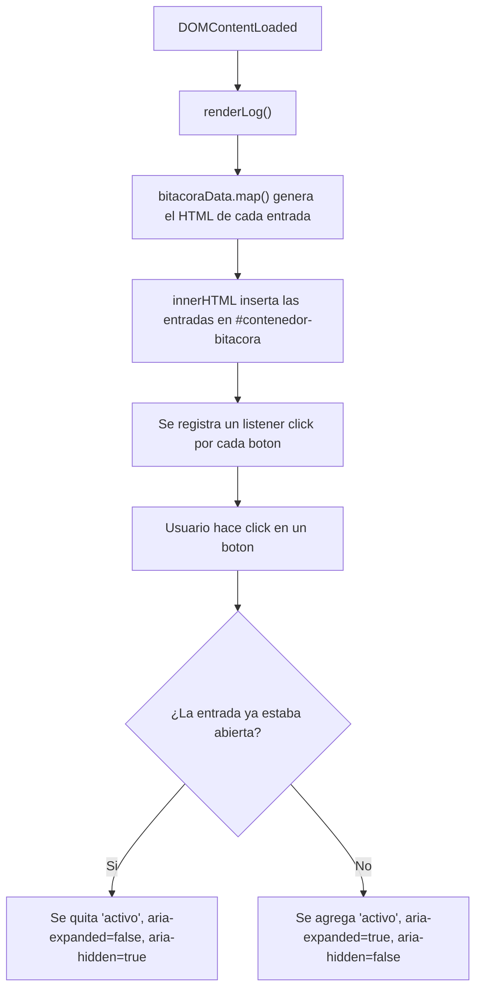
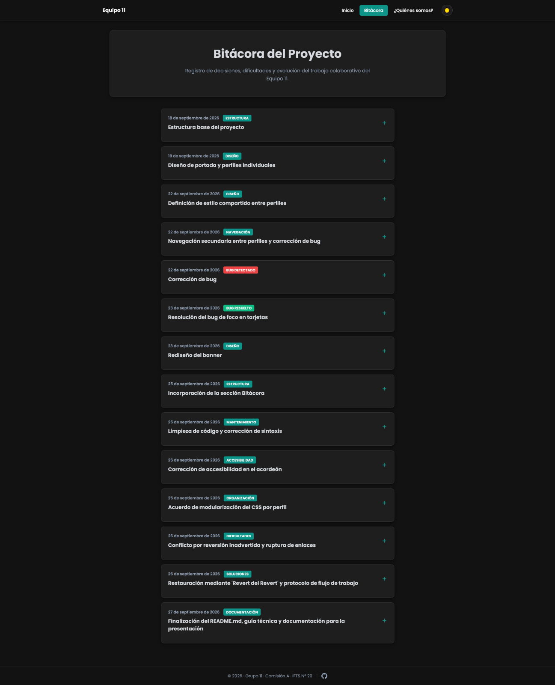
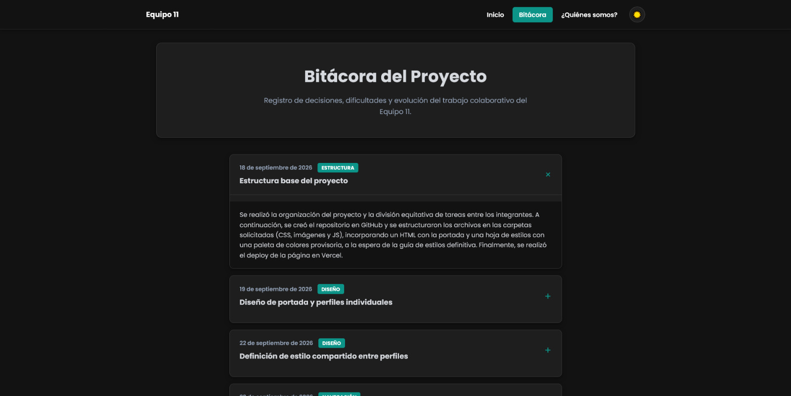

### Bitácora (`bitacora.html`)

La bitácora utiliza JavaScript para transformar un modelo de datos en HTML real y para controlar la interacción de acordeón sobre las entradas ya renderizadas. A diferencia de la portada, acá el foco no está en animaciones sino en la separación entre datos, marcado semántico y comportamiento.

#### 1. Comportamiento de JavaScript

**Objetivo**

Mostrar cada entrada colapsada por defecto y permitir expandirla al hacer clic, sin perder semántica de encabezados ni incluir contenido inválido dentro del botón interactivo.

**Funcionamiento**

Al disparar `DOMContentLoaded`, `renderLog()` recorre `bitacoraData` con `.map()` y genera un fragmento de HTML por entrada, los une con `.join('')` y los inserta de una sola vez en `#contenedor-bitacora` mediante `innerHTML`. Cada entrada queda armada como un `<article>` con un encabezado (`<h2>` que envuelve un `<button>`) y un panel de contenido oculto por defecto (`aria-hidden="true"`).

Una vez insertado el HTML, se registra un listener de `click` sobre cada `.timeline-header`. Al activarlo, se alterna la clase `activo` en el `<article>` correspondiente y se actualizan en conjunto `aria-expanded` (en el botón) y `aria-hidden` (en el panel), de modo que el estado visual y el estado accesible nunca queden desincronizados:

```js
header.addEventListener("click", () => {
  const item = header.closest(".timeline-item");
  const content = item.querySelector(".timeline-content");
  const isOpen = item.classList.contains("activo");

  item.classList.toggle("activo", !isOpen);
  header.setAttribute("aria-expanded", String(!isOpen));
  content.setAttribute("aria-hidden", String(isOpen));
});
```



**Implementación técnica**

* `.map()` / `.join('')` transforman el array de datos en un único string de HTML.
* `querySelectorAll(".timeline-header")` selecciona los botones ya insertados.
* `classList.toggle()` / `contains()` controlan el estado visual de cada entrada.
* `closest(".timeline-item")` ubica el `<article>` contenedor a partir del botón, sin depender de la profundidad exacta del DOM.
* `setAttribute()` mantiene `aria-expanded` y `aria-hidden` sincronizados con el estado real.

**Accesibilidad**

Cada botón está envuelto por un `<h2>`, así que sigue existiendo como encabezado navegable para un lector de pantalla aunque todo el bloque (fecha, categoría, título, ícono) sea clickeable. `aria-controls` conecta cada botón con el `id` de su panel, y `aria-labelledby` conecta el panel de vuelta con su encabezado.




---

#### 2. Modularización

**Objetivo**

Separar el contenido de la bitácora (fechas, categorías, títulos, textos) de la lógica que lo convierte en HTML y le agrega interactividad, para que agregar una entrada nueva no implique tocar código de comportamiento.

**Funcionamiento**

El array de entradas vive en su propio archivo, `bitacoraData.js`, expuesto con `export`. `bitacora.js` lo importa y es el único responsable de renderizarlo e inicializar la interacción:

```js
export const bitacoraData = [
  { fecha: "18 de septiembre de 2026", categoria: "Estructura", titulo: "...", texto: "..." },
  // una entrada nueva es un objeto más en este array
];
```

```js
import { bitacoraData } from "./bitacoraData.js";
```

**Implementación técnica**

* Ambos archivos son módulos ES nativos (`import` / `export`), por lo que `bitacora.html` los carga con `<script type="module" src="js/bitacora.js"></script>` en vez de un `<script>` común.
* Los módulos son la razón por la que este comportamiento no funciona si se abre el HTML directamente desde el explorador de archivos (`file:///`): el navegador bloquea los `import` entre archivos locales por política de CORS, y sí funciona una vez servido por HTTP (Live Server o el deploy de Vercel).

---

#### 3. Evolución de la implementación

La primera versión tenía un `<div>` y un `<h3>` anidados directamente dentro del `<button>` del acordeón, lo cual es HTML inválido: un `button` solo admite contenido de frase (`span`, texto), no `div` ni encabezados. Además, ese `h3` saltaba de nivel, porque en la página solo existe un `h1` y no había ningún `h2` intermedio.

Se resolvió envolviendo el `<button>` con un `<h2>` y reemplazando el `div`/`h3` interno por `span`, siguiendo el patrón de acordeón documentado en las guías de accesibilidad de la W3C (ARIA Authoring Practices). Esto evitó tener que elegir entre encabezado semántico y área clickeable completa: se mantienen las dos cosas.

Como consecuencia de ese cambio de estructura, `header.parentElement` dejó de apuntar al `<article>` (ahora apunta al `<h2>`), así que la función de toggle se corrigió usando `header.closest(".timeline-item")`. También se agregaron `id` únicos por entrada para poder vincular `aria-controls`/`aria-labelledby`, y se sumó el atributo `type="module"` al script (ausente en una versión intermedia, lo que impedía que se ejecutara cualquier código). Por último, se restituyó la etiqueta `<main>`, que se había perdido en el reordenamiento del HTML y de la que dependen tanto el layout (`max-width`, padding) definido en `styles.css` como el landmark de navegación para tecnologías de asistencia.

---

#### Resumen de APIs y mecanismos utilizados

| Recurso | Uso |
| --- | --- |
| ES Modules (`import` / `export`) | Separar el modelo de datos (`bitacoraData.js`) del comportamiento (`bitacora.js`) |
| `Array.prototype.map()` | Transformar cada objeto de `bitacoraData` en un fragmento de HTML |
| `Array.prototype.join('')` | Unir los fragmentos en un único string antes de insertarlos |
| `innerHTML` | Insertar todo el HTML generado en `#contenedor-bitacora` |
| `querySelectorAll()` | Seleccionar los botones del acordeón ya insertados |
| `addEventListener("click", ...)` | Escuchar la interacción sobre cada botón |
| `classList` | Controlar el estado visual (`activo`) de cada entrada |
| `closest()` | Ubicar el `<article>` contenedor a partir del botón |
| `setAttribute()` | Sincronizar `aria-expanded` y `aria-hidden` con el estado real |
| `aria-controls` / `aria-labelledby` | Vincular cada botón con su panel para lectores de pantalla |
| Template literals | Generar IDs únicos por entrada (`header-bitacora-${indice}`, `panel-bitacora-${indice}`) |
