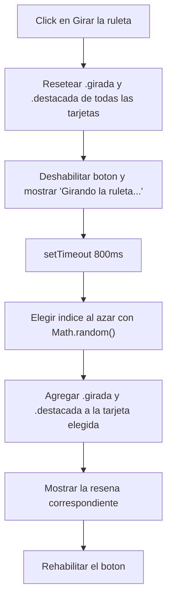

# Perfil individual (`perfil_cande.html`)

El perfil individual utiliza JavaScript para dos comportamientos dinámicos: el giro de las tarjetas de películas al hacer click o presionar Enter/Espacio, y un recomendador que elige una película al azar y la muestra girada y resaltada. El resto de la interfaz (discos, habilidades, tipografía, colores) se resuelve enteramente con HTML y CSS, sin necesitar JavaScript.

## Comportamiento de JavaScript

### 1. Tarjetas flip de películas

**Objetivo**

Permitir ver una reseña corta de cada película sin ocupar espacio permanente en la página: la información extra queda oculta hasta que la persona interactúa con la tarjeta.

**Funcionamiento**

Cada tarjeta `.flip-card` tiene un frente (poster + título + director) y un dorso (una frase sobre la película), montados uno encima del otro con `rotateY` y `backface-visibility: hidden`. JavaScript no anima nada directamente: solo agrega o saca la clase `.girada` del contenedor, y es esa clase la que dispara la transición 3D vía CSS.

1. Se recorren todas las `.flip-card` dentro del contenedor recibido.
2. Al click, se togglea `.girada`.
3. Al presionar Enter o Espacio estando la tarjeta enfocada, se hace lo mismo (accesibilidad de teclado).

**Implementación técnica**

* `querySelectorAll(".flip-card")` obtiene las tarjetas de la grilla recibida por parámetro.
* `classList.toggle("girada")` controla el estado visual sin necesidad de guardar el estado en una variable aparte: el propio DOM es la fuente de verdad.
* `evento.preventDefault()` en el `keydown` evita que la tecla Espacio haga scroll de la página mientras la tarjeta está enfocada.
* `if (!contenedor) return;` corta la función temprano si el id recibido no existe en la página, para no romper el resto del script si algún día se la llama con un id inválido.

### 2. Recomendador dinámico (ruleta)

**Objetivo**

Dar una interacción extra, independiente del click sobre cada tarjeta, que elija una película al azar y la muestre destacada junto a una reseña.

**Funcionamiento**

Al presionar el botón, se resetean todas las tarjetas de películas, se deshabilita el botón para evitar clicks repetidos mientras "gira", y tras un retraso simulado de 800ms se elige un índice al azar, se gira esa tarjeta y se le agrega `.destacada` (el mismo mecanismo de clases que el punto 1, sumado a un segundo modificador), mostrando además su reseña en el texto de resultado.

**Implementación técnica**

* `Math.floor(Math.random() * tarjetasPeliculas.length)` genera un índice entero válido dentro del arreglo de reseñas.
* El arreglo `resenas` está indexado en el mismo orden que las tarjetas en el HTML, así el índice elegido sirve para ambos a la vez.
* `setTimeout(..., 800)` es puramente cosmético: simula que la ruleta "piensa" antes de mostrar el resultado, en vez de cambiar todo instantáneamente.
* El chequeo `if (btnRecomendar && contenedorResultado && tarjetasPeliculas.length > 0)` evita que el script falle si alguno de esos elementos no está presente en la página.

## Modularización

El archivo se separa en dos bloques independientes que no comparten estado entre sí:

* `iniciarFlipCards(idContenedor)` es una función genérica y reutilizable: recibe el id de una grilla y no sabe nada sobre películas ni discos en particular. Aunque hoy solo se llama una vez (`"flip-peliculas"`), si en el futuro se agrega otra grilla de tarjetas que giran, alcanza con una línea más — no hay que duplicar la lógica de click/teclado.
* La lógica del recomendador vive fuera de esa función, como un bloque aparte que sí conoce el contenido real (`resenas`, `tarjetasPeliculas`). Mantenerlo separado evita que una función genérica de UI (girar tarjetas) termine mezclada con contenido específico de este perfil (qué dice cada reseña).

Esta separación —comportamiento genérico reutilizable por un lado, contenido específico del perfil por el otro— es la misma idea que plantea la consigna al pedir CSS y JS organizados en carpetas separadas: acá se aplica también puertas adentro de un mismo archivo.

## Evolución

El código pasó por varias correcciones a medida que se lo fue probando:

1. **Bug de listener duplicado.** En una versión intermedia, `iniciarFlipCards("flip-peliculas")` se llamaba dos veces por error. Cada tarjeta terminaba con dos listeners de click, y al togglear `.girada` dos veces en el mismo evento el cambio se cancelaba a sí mismo: las tarjetas dejaban de girar visualmente aunque el código "funcionaba" sin errores. Se corrigió dejando una sola llamada por grilla.
2. **De vinilos a tarjetas reutilizadas.** Los discos se mostraban al principio con un diseño de vinilo giratorio (`.disco-card`, `.vinilo`) con su propia lógica visual. Se reemplazó por `.flip-card-fija`, que reutiliza el mismo lenguaje visual del frente de una tarjeta de película (imagen, título, autor) pero sin la mitad del mecanismo: no tiene dorso, no escucha clicks ni teclado, porque no hay nada que revelar del otro lado. Esto simplificó el JS en vez de complicarlo: la función `iniciarFlipCards` dejó de llamarse sobre la grilla de discos.
3. **Auditoría de contraste.** Una herramienta de accesibilidad marcó que el texto blanco del botón del recomendador no llegaba al contraste mínimo de WCAG contra el fondo rosa. Revisando el resto del perfil con el mismo criterio aparecieron dos casos más (los títulos de sección y las etiquetas de habilidades) con el mismo problema de fondo: un rosa de marca que es demasiado claro para texto blanco y, a la vez, demasiado oscuro para funcionar igual en los dos temas de color. Se resolvió sin tocar el JS, solo ajustando las variables de color en CSS para que dependieran del tema activo.

## Separación entre JavaScript y CSS

JavaScript se ocupa únicamente de:

* togglear las clases `.girada` y `.destacada`;
* deshabilitar/habilitar el botón y cambiar su texto de resultado;
* elegir un índice al azar.

CSS se ocupa de todo lo visual:

* la transición del giro (`rotateY`, `transition`, `preserve-3d`);
* qué significa cada clase (`.girada` gira, `.destacada` agranda y agrega sombra);
* los colores, tamaños y contraste de cada estado.

Ningún valor de color, tamaño o duración de animación aparece escrito en el JS: si mañana cambia el diseño, alcanza con tocar el CSS.

## Resumen de APIs y mecanismos utilizados

| Recurso              | Uso |
| ---                  | --- |
| `querySelectorAll()` | Selección de las tarjetas dentro de cada grilla |
| `addEventListener()` | Gestión de clicks, teclado y el botón del recomendador |
| `classList.toggle()` / `classList.remove()` / `classList.add()` | Control de los estados `.girada` y `.destacada` |
| `evento.preventDefault()` | Evita que Espacio haga scroll de página al girar con teclado |
| `Math.random()` / `Math.floor()` | Elección del índice al azar en el recomendador |
| `setTimeout()` | Retraso simulado antes de mostrar el resultado |
| `aria-live="polite"` | Anuncia el resultado de la ruleta a lectores de pantalla |
| `tabindex="0"` / `role="button"` | Permite girar las tarjetas de película con teclado |
