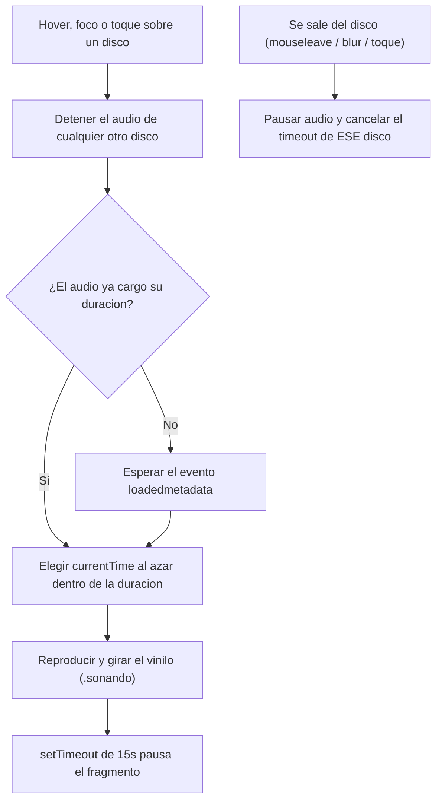
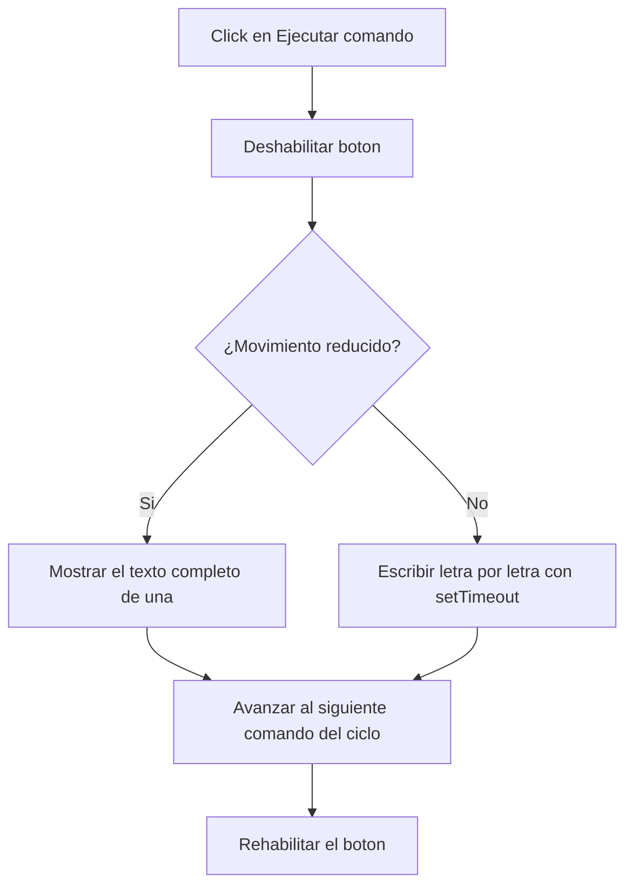

# Perfil individual (`perfil_fede.html`)

El perfil utiliza JavaScript para tres comportamientos dinámicos: adaptar la interacción de las películas a dispositivos táctiles, hacer que los discos revelen un vinilo con la tapa impresa y reproduzcan un fragmento de audio aleatorio al pasar el mouse (o el foco, o el toque), y una mini terminal que escribe comandos simulados letra por letra. El resto de la estética —panel cyberpunk, chips de habilidades, glitch del título y biselados— se resuelve enteramente con CSS.

## Comportamiento de JavaScript

### 1. Interacción táctil en películas

**Objetivo**

En escritorio, el brillo neón de las películas se dispara con `:hover` y `:focus-visible`. En dispositivos táctiles no existe `:hover`, así que hace falta un mecanismo equivalente activado por toque.

**Funcionamiento**

Se detecta el tipo de puntero con `window.matchMedia("(pointer: coarse)")`. Al tocar una `.fede-peli`, si el puntero es táctil se alterna la clase `.activo`, quitándola antes de cualquier otra película activa (para que solo una quede resaltada a la vez).

**Implementación técnica**

* `matchMedia("(pointer: coarse)")` detecta el tipo de puntero sin repetir la consulta en cada evento.
* `classList.toggle()` / `classList.remove()` controlan el estado visual; el propio DOM es la fuente de verdad.
* El evento `change` de la media query limpia los estados `.activo` si el dispositivo deja de ser táctil (por ejemplo, se conecta un mouse).

**Accesibilidad**

Las películas tienen `tabindex="0"`, así que también se pueden enfocar con teclado; en ese caso el efecto se dispara por `:focus-visible` en CSS, sin depender de JavaScript.


---

### 2. Discos: vinilo con la tapa impresa y fragmento de audio aleatorio

**Objetivo**

Simular un "picture disc" (un vinilo con el arte del álbum impreso) que se desliza fuera de la funda al pasar el mouse, el foco de teclado o el toque, y que además reproduce un fragmento aleatorio del disco mientras está expuesto — como si se "girara la ruleta" cada vez que se vuelve a interactuar.

**Funcionamiento**

Cada disco (`.fede-disco`) declara su archivo de audio en `data-audio`. Al cargar la página, se crea un `Audio` por disco y se guarda en un `Map`, junto con su propio temporizador y una bandera `expuesto`:

```js
const estadoDiscos = new Map();

discos.forEach((disco) => {
  const rutaAudio = disco.dataset.audio;
  estadoDiscos.set(disco, {
    audio: rutaAudio ? new Audio(rutaAudio) : null,
    expuesto: false,
    temporizador: null,
  });
});
```

Al pasar el mouse, enfocar con teclado o tocar un disco, `reproducirFragmentoAleatorio()` elige un punto al azar dentro de la duración del audio y reproduce desde ahí durante un máximo de 15 segundos:

```js
const duracionTotal = audio.duration || 0;
const margen = Math.min(DURACION_FRAGMENTO / 1000, duracionTotal * 0.9);
audio.currentTime = Math.random() * (duracionTotal - margen);
audio.play();
```

Al salir del disco (`mouseleave` / `blur`, o un segundo toque en táctil), se pausa el audio y se cancela el temporizador de ese disco puntual.



El giro del vinilo (`.fede-vinilo-disco`) está atado a la clase `.activo`, no al audio: gira mientras el vinilo está expuesto, tenga o no un archivo de audio asignado todavía.

**Implementación técnica**

* Cada disco tiene su **propio** `Audio` y su **propio** `setTimeout`, guardados en un `Map` — ningún disco comparte estado con otro (ver la sección de Evolución para el bug que esto resolvió).
* La bandera `expuesto` evita que un audio que tardó en cargar (`loadedmetadata`) arranque igual si el usuario ya se fue de ese disco antes de que la carga terminara.
* `Math.random() * (duracionTotal - margen)` elige el punto de inicio, dejando un margen para no arrancar a menos de `DURACION_FRAGMENTO` del final del archivo.
* `audio.play().catch(() => {})` evita que la promesa rechazada de `play()` rompa el resto del script si el navegador bloquea la reproducción.
* `document.addEventListener("visibilitychange", ...)` pausa todo audio en curso si el usuario cambia de pestaña.

**Accesibilidad**

Los discos tienen `tabindex="0"` y un `aria-label` que describe la acción ("Escuchar un fragmento aleatorio de [disco] al pasar el mouse o el foco"). El foco de teclado (`focus`/`blur`) dispara exactamente el mismo comportamiento que el `mouseenter`/`mouseleave`, así la funcionalidad no depende únicamente del mouse.

**Una limitación a tener en cuenta**

Los navegadores solo permiten reproducir audio automáticamente después de un gesto directo del usuario (un click o una tecla), y **un hover o un foco no cuentan como gesto válido** para esa política. En la práctica, el primer disco sobre el que se pasa el mouse en toda la sesión puede no sonar (el `.catch()` evita que esto rompa algo), pero una vez que el usuario hizo cualquier click en la página, el resto de las reproducciones funcionan con normalidad. No es un bug del código, es una restricción estándar de todos los navegadores.


---

### 3. Mini terminal

**Objetivo**

Dar una interacción propia y coherente con el perfil: un botón que "ejecuta" comandos y muestra la salida como si fuera una terminal real.

**Funcionamiento**

Al hacer clic en el botón, se deshabilita para evitar clics repetidos, y la función `escribir()` va revelando el texto letra por letra usando `setTimeout` recursivo, hasta completar el comando y su salida. Al terminar, se habilita de nuevo el botón y se prepara el próximo comando del ciclo (`whoami` → `stack --lista` → `ls discos/` → vuelve a `whoami`):

```js
function escribir(texto) {
  return new Promise((resolver) => {
    if (movimientoReducido.matches) {
      salida.textContent = texto;
      resolver();
      return;
    }
    let posicion = 0;
    function paso() {
      posicion += 1;
      salida.textContent = texto.slice(0, posicion);
      if (posicion < texto.length) setTimeout(paso, 18);
      else resolver();
    }
    paso();
  });
}
```



**Implementación técnica**

* `Promise` + `async/await` permiten esperar a que termine de "tipearse" el texto antes de rehabilitar el botón y avisar el próximo comando.
* El índice del comando (`indiceComando`) avanza con el operador módulo (`% comandos.length`), así el ciclo vuelve a empezar solo.
* `aria-live="polite"` en `#resultado-interaccion` anuncia el contenido a lectores de pantalla a medida que se actualiza.
* `window.matchMedia("(prefers-reduced-motion: reduce)")` evita el efecto de tipeo cuando el usuario prefiere menos movimiento, mostrando el resultado final de inmediato.


---

### 4. Fallback de imágenes rotas

**Objetivo**

Los pósters de películas, las carátulas y las tapas impresas en los vinilos tienen, como respaldo visual, un degradé de colores propio de cada ítem. Si una imagen no existe o falla, conviene que se vea ese degradé en vez del ícono de imagen rota del navegador.

**Funcionamiento**

Se recorren todas las imágenes de películas, carátulas y vinilos; si disparan el evento `error`, o si ya fallaron antes de que el script se ejecutara (`imagen.complete && imagen.naturalWidth === 0`), se eliminan del DOM:

```js
document
  .querySelectorAll(".fede-peli-img, .fede-funda-img, .fede-vinilo-img")
  .forEach((imagen) => {
    const quitar = () => imagen.remove();
    imagen.addEventListener("error", quitar);
    if (imagen.complete && imagen.naturalWidth === 0) quitar();
  });
```

**Implementación técnica**

* El chequeo `imagen.complete && imagen.naturalWidth === 0` cubre el caso en que la imagen ya falló antes de que `fede_perfil.js` terminara de cargar.
* Al eliminar el `` en vez de ocultarlo, vuelve a quedar visible el fondo CSS de respaldo, sin que quede un hueco vacío.

---

## Modularización

`fede_perfil.js` concentra toda la lógica de este perfil en un único archivo, separado de `styles_fede.css` (que resuelve la parte visual) y de `main.js` (que maneja el comportamiento global del sitio, compartido por todos los perfiles). Esto sigue el acuerdo del equipo de modularizar CSS y JS por integrante.

## Evolución

El perfil pasó por varias iteraciones, con algunos bugs concretos detectados y corregidos en el camino:

1. **Versión inicial**: habilidades como lista con viñetas, películas y discos como texto plano, sin CSS ni JS propios.
2. **Primera versión con identidad propia**: chips de habilidades agrupados por categoría, discos con un vinilo de colores planos que se deslizaba al interactuar, más la mini terminal como gadget interactivo.
3. **Rediseño cyberpunk**: panel oscuro con bordes biselados (`clip-path`) y acentos neón cian/magenta/amarillo, con un glitch en el título que se repite cada 6 segundos.
4. **Incorporación de imágenes**: se reemplazaron los degradés de fondo de películas y discos por pósters y carátulas reales, conservando el degradé como respaldo si una imagen no carga.
5. **De click a hover**: la interacción de los discos arrancó disparada por click; se cambió a `hover`/`focus` en escritorio (con el toque como equivalente en táctil), para mantener la misma lógica que ya usaban las películas.
6. **Vinilo con la tapa impresa ("picture disc")**: se reemplazó el círculo de colores planos por la carátula real recortada en círculo, con los surcos superpuestos encima. Esto expuso un bug: `.fede-vinilo-disco` es un `<span>` con `position: relative`, y los elementos `inline` ignoran `width`/`height` salvo que se les cambie el `display`. La caja colapsaba a 0×0 y el vinilo quedaba invisible aunque el `transform` sí se aplicaba correctamente. Se corrigió agregando `display: block`.
7. **Ajuste del desplazamiento**: una vez visible la caja, hubo que recalibrar el `translateX` del vinilo. Como `.fede-funda` tiene las esquinas cortadas en diagonal (`clip-path`), un desplazamiento moderado (~45%) alcanza para que el vinilo asome por ese corte, en vez de un valor extremo que lo saca por completo del área del disco.
8. **Giro atado a la exposición, no al audio**: la animación de rotación se cambió de depender de `.sonando` (solo mientras suena) a depender de `.activo`, para que el vinilo gire apenas está expuesto, incluso en discos que todavía no tienen audio asignado.
9. **Fragmentos de audio aleatorios — condición de carrera**: la primera versión usaba una única variable compartida (`audioActual`, `temporizadorFragmento`) entre los tres discos. Al pasar rápido de un disco a otro, el callback asíncrono `loadedmetadata` de un disco anterior podía resolverse *después* de que esas variables ya apuntaran al disco siguiente, haciendo que el audio equivocado arrancara o se reposicionara. Se corrigió dándole a cada disco su propio `Audio` y su propio temporizador guardados en un `Map`, más una bandera `expuesto` por disco que cancela el arranque si el usuario ya se fue quando el audio recién termina de cargar.

## Separación entre JavaScript y CSS

JavaScript se ocupa únicamente de:

* alternar la clase `.activo` en películas (táctil) y discos (hover, foco o toque);
* crear y controlar la reproducción de audio de cada disco (`Audio`, `currentTime`, `play`/`pause`);
* deshabilitar/habilitar el botón de la terminal y controlar el tipeo del texto;
* quitar del DOM las imágenes que fallan al cargar.

CSS se ocupa de todo lo visual: el brillo neón, el desplazamiento y el giro del vinilo, el glitch del título, los cortes biselados y los colores de cada estado. El único valor de tiempo que vive en el JS es `DURACION_FRAGMENTO` (cuánto dura cada fragmento de audio), porque es un dato de comportamiento, no de estilo.

## Resumen de APIs y mecanismos utilizados

| Recurso | Uso |
| --- | --- |
| `matchMedia()` | Detectar tipo de puntero y preferencia de movimiento reducido |
| `addEventListener("click"/"mouseenter"/"mouseleave"/"focus"/"blur"/"change"/"error", ...)` | Interacción táctil de películas, hover/foco/toque de discos, fallback de imágenes |
| `classList.toggle()` / `classList.remove()` / `classList.add()` | Control de los estados `.activo` y `.sonando` |
| `Map` | Guardar el audio, el temporizador y el estado de "expuesto" de cada disco por separado |
| `Audio()` / `.play()` / `.pause()` / `.currentTime` / `.duration` | Reproducción de fragmentos de audio |
| `Math.random()` | Elección del punto de inicio aleatorio dentro de cada disco |
| `setTimeout()` / `clearTimeout()` | Efecto de escritura de la terminal y duración de cada fragmento de audio |
| `document.visibilitychange` | Pausar todo audio en curso al cambiar de pestaña |
| `Promise` / `async-await` | Esperar a que termine el efecto de tipeo antes de continuar |
| `imagen.complete` / `imagen.naturalWidth` | Detectar imágenes que ya fallaron antes de cargar el script |
| `aria-live="polite"` | Anunciar el resultado de la terminal a lectores de pantalla |
| `aria-label` | Describir la acción de hover/foco en cada disco para lectores de pantalla |
| `tabindex="0"` | Permitir enfocar películas y discos con teclado |
