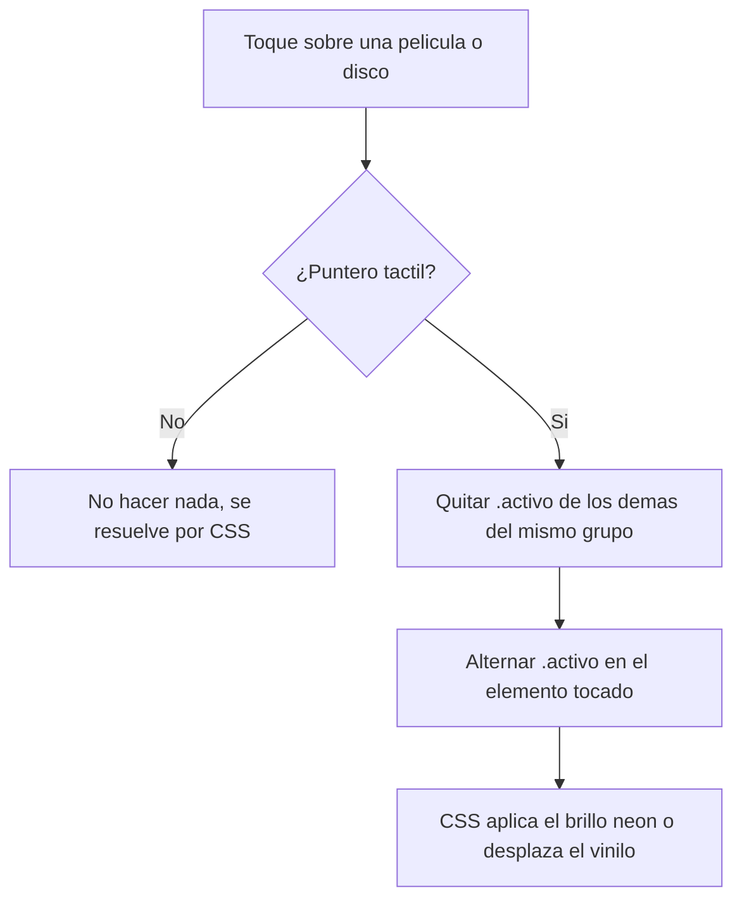
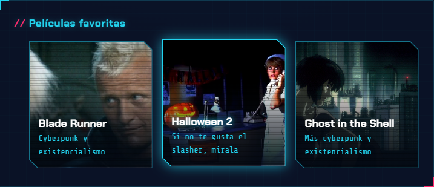
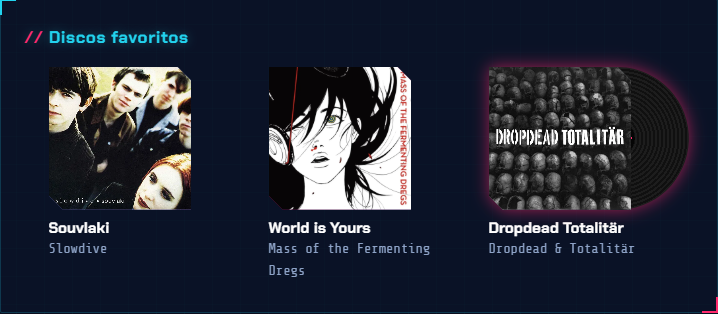
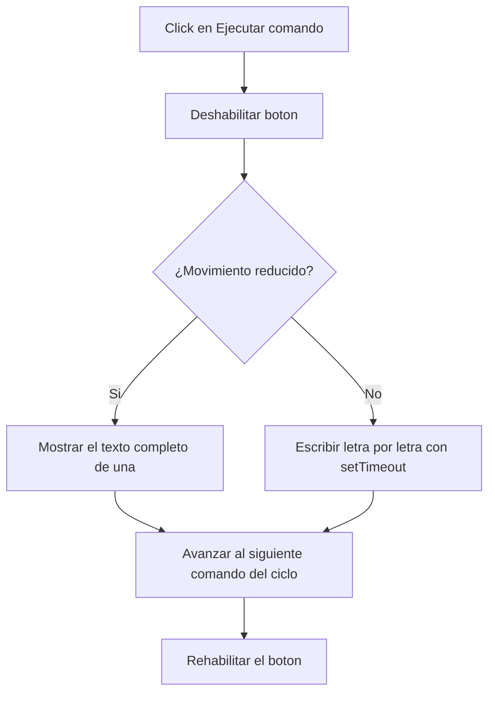
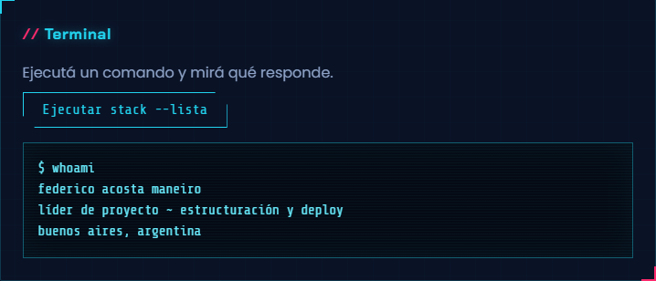

# Perfil individual (`perfil_fede.html`)

El perfil de Fede utiliza JavaScript para dos comportamientos dinámicos: adaptar la interacción de películas y discos a dispositivos táctiles, y una mini terminal que escribe comandos simulados letra por letra. El resto de la estética —panel cyberpunk, chips de habilidades, glitch del título, vinilos y biselados— se resuelve enteramente con CSS.

## Comportamiento de JavaScript

### 1. Interacción táctil en películas y discos

**Objetivo**

En escritorio, el brillo neón de las películas y el desplazamiento del vinilo de los discos se disparan con `:hover` y `:focus-visible`. En dispositivos táctiles no existe `:hover`, así que hace falta un mecanismo equivalente activado por toque.

**Funcionamiento**

Se detecta el tipo de puntero con `window.matchMedia("(pointer: coarse)")`. Al tocar una `.fede-peli` o un `.fede-disco`, si el puntero es táctil se alterna la clase `.activo` sobre ese elemento, después de quitarla de cualquier otro elemento del mismo tipo (para que solo una película o un disco quede resaltado a la vez):

```js
elemento.addEventListener("click", () => {
  if (!punteroTactil.matches) return;

  const grupo = elemento.classList.contains("fede-peli") ? ".fede-peli" : ".fede-disco";

  document.querySelectorAll(`${grupo}.activo`).forEach((otro) => {
    if (otro !== elemento) otro.classList.remove("activo");
  });

  elemento.classList.toggle("activo");
});
```

Si el dispositivo deja de ser táctil (por ejemplo, se conecta un mouse), un listener de `change` sobre la media query limpia cualquier `.activo` que haya quedado.



**Implementación técnica**

* `matchMedia("(pointer: coarse)")` detecta el tipo de puntero sin repetir la consulta en cada evento.
* `classList.contains()` distingue si el elemento tocado es una película o un disco, para no mezclar los grupos.
* `classList.toggle()` / `classList.remove()` controlan el estado visual; el propio DOM es la fuente de verdad, no hay variables de estado separadas.
* El evento `change` de la media query mantiene consistente la interfaz si el contexto de interacción cambia en tiempo real.

**Accesibilidad**

Las películas y discos tienen `tabindex="0"`, así que también se pueden enfocar con teclado. En ese caso el efecto se dispara por `:focus-visible` en CSS, sin depender de JavaScript.




---

### 2. Mini terminal

**Objetivo**

Dar una interacción propia y coherente con el perfil (developer/cyberpunk): un botón que "ejecuta" comandos y muestra la salida como si fuera una terminal real.

**Funcionamiento**

Al hacer clic en el botón, se deshabilita para evitar clics repetidos, y la función `escribir()` va revelando el texto letra por letra usando `setTimeout` recursivo, hasta completar el comando y su salida. Al terminar, se habilita de nuevo el botón y se prepara el próximo comando del ciclo (`whoami` → `stack --lista` → `ls discos/` → vuelve a `whoami`):

```js
function escribir(texto) {
  return new Promise((resolver) => {
    if (movimientoReducido.matches) {
      salida.textContent = texto;
      resolver();
      return;
    }
    let posicion = 0;
    function paso() {
      posicion += 1;
      salida.textContent = texto.slice(0, posicion);
      if (posicion < texto.length) setTimeout(paso, 18);
      else resolver();
    }
    paso();
  });
}
```



**Implementación técnica**

* `Promise` + `async/await` permiten esperar a que termine de "tipearse" el texto antes de rehabilitar el botón y avisar el próximo comando.
* El índice del comando (`indiceComando`) avanza con el operador módulo (`% comandos.length`), así el ciclo vuelve a empezar solo.
* `aria-live="polite"` en `#resultado-interaccion` anuncia el contenido a lectores de pantalla a medida que se actualiza.
* `window.matchMedia("(prefers-reduced-motion: reduce)")` evita el efecto de tipeo cuando el usuario prefiere menos movimiento, mostrando el resultado final de inmediato.



---

### 3. Fallback de imágenes rotas

**Objetivo**

Los pósters de películas y las carátulas de discos tienen, como respaldo visual, un degradé de colores propio de cada ítem. Si la imagen no existe o falla, conviene que se vea ese degradé en vez del ícono de imagen rota del navegador.

**Funcionamiento**

Se recorren todas las imágenes de películas y discos; si disparan el evento `error`, o si ya fallaron antes de que el script se ejecutara (`imagen.complete && imagen.naturalWidth === 0`), se eliminan del DOM:

```js
document.querySelectorAll(".fede-peli-img, .fede-funda-img").forEach((imagen) => {
  const quitar = () => imagen.remove();
  imagen.addEventListener("error", quitar);
  if (imagen.complete && imagen.naturalWidth === 0) quitar();
});
```

**Implementación técnica**

* El chequeo `imagen.complete && imagen.naturalWidth === 0` cubre el caso en que la imagen ya falló antes de que `fede_perfil.js` terminara de cargar (por ejemplo, si el archivo no existe y el error ocurrió muy rápido).
* Al eliminar el `` en vez de ocultarlo, vuelve a quedar visible el fondo CSS (`.fede-peli-cara::before` / `background` de `.fede-funda`) sin que quede un hueco vacío.

---

## Modularización

`fede_perfil.js` concentra toda la lógica de este perfil en un único archivo, separado de `styles_fede.css` (que resuelve la parte visual) y de `main.js` (que maneja el comportamiento global del sitio, compartido por todos los perfiles). Esto sigue el acuerdo del equipo de modularizar CSS y JS por integrante.

## Evolución

El perfil pasó por varias iteraciones:

1. **Versión inicial**: habilidades como lista con viñetas, películas y discos como texto plano, sin CSS ni JS propios.
2. **Primera versión con identidad propia**: chips de habilidades agrupados por categoría, discos con efecto de vinilo deslizante y películas con brillo al interactuar, más la mini terminal como gadget interactivo.
3. **Rediseño cyberpunk**: se llevó la estética a un panel oscuro con bordes biselados (`clip-path`) y acentos neón cian/magenta/amarillo, incluyendo un efecto de glitch en el título que se repite cada 6 segundos.
4. **Incorporación de imágenes**: se reemplazaron los degradés de fondo de películas y discos por pósters y carátulas reales, conservando el degradé como respaldo si una imagen no carga (ver punto 3 de JavaScript).

## Separación entre JavaScript y CSS

JavaScript se ocupa únicamente de:

* alternar la clase `.activo` en dispositivos táctiles;
* deshabilitar/habilitar el botón de la terminal y controlar el tipeo del texto;
* quitar del DOM las imágenes que fallan al cargar.

CSS se ocupa de todo lo visual: el brillo neón, el desplazamiento del vinilo, el glitch del título, los cortes biselados y los colores de cada estado. Ningún valor de color, tamaño o duración aparece escrito en el JS.

## Resumen de APIs y mecanismos utilizados

| Recurso | Uso |
| --- | --- |
| `matchMedia()` | Detectar tipo de puntero y preferencia de movimiento reducido |
| `addEventListener("click"/"change"/"error", ...)` | Interacción táctil, cambio de puntero y fallback de imágenes |
| `classList.toggle()` / `classList.remove()` | Control del estado `.activo` en películas y discos |
| `Promise` / `async-await` | Esperar a que termine el efecto de tipeo antes de continuar |
| `setTimeout()` | Efecto de escritura letra por letra |
| `imagen.complete` / `imagen.naturalWidth` | Detectar imágenes que ya fallaron antes de cargar el script |
| `aria-live="polite"` | Anunciar el resultado de la terminal a lectores de pantalla |
| `tabindex="0"` | Permitir enfocar películas y discos con teclado |
