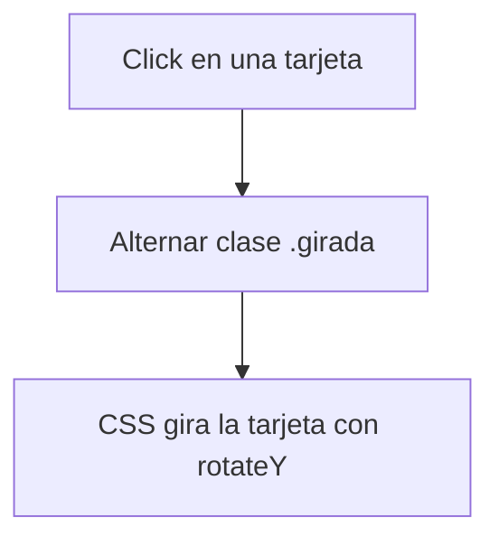
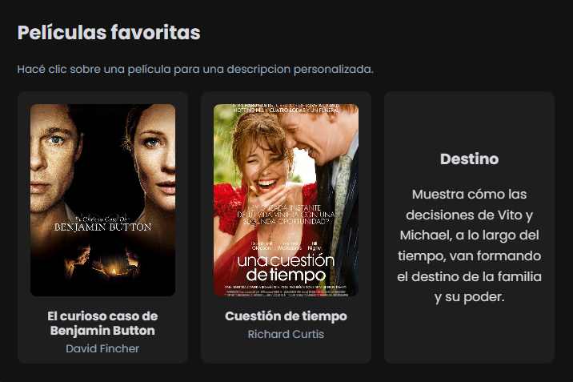
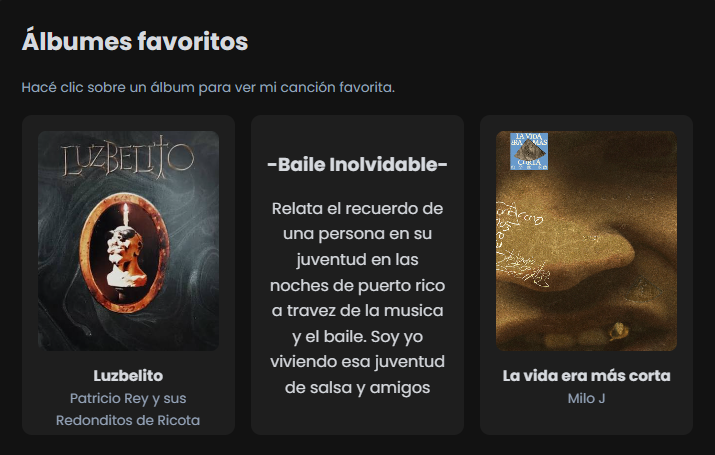
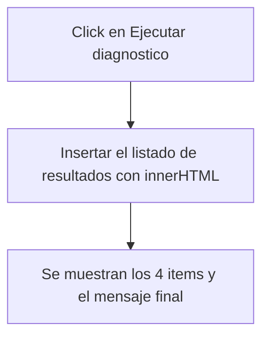

# Perfil individual (`perfil_marcos.html`)

El perfil de Marcos utiliza JavaScript para dos comportamientos: el giro de las tarjetas flip de películas y álbumes al hacer clic, y un botón de diagnóstico QA que simula la ejecución de una batería de pruebas sobre el sitio. El resto del perfil (habilidades, tipografía, colores) se resuelve con HTML y CSS.

## Comportamiento de JavaScript

### 1. Tarjetas flip de películas y álbumes

**Objetivo**

Mostrar, del otro lado de cada tarjeta, un comentario personal sobre la película o el álbum, sin ocupar espacio permanente en la página.

**Funcionamiento**

Cada tarjeta (`.marcos-flip-card` para películas, `.marcos-album-card` para álbumes) tiene un frente y un dorso montados uno sobre el otro con `rotateY` y `backface-visibility: hidden`. Al hacer clic, se alterna la clase `.girada`, que dispara la rotación 3D vía CSS:

```js
document.querySelectorAll(".marcos-flip-card").forEach((tarjeta) => {
  tarjeta.addEventListener("click", () => {
    tarjeta.classList.toggle("girada");
  });
});

document.querySelectorAll(".marcos-album-card").forEach((tarjeta) => {
  tarjeta.addEventListener("click", () => {
    tarjeta.classList.toggle("girada");
  });
});
```



**Implementación técnica**

* `querySelectorAll()` selecciona por separado las tarjetas de películas y de álbumes, ya que son dos grillas independientes.
* `classList.toggle("girada")` controla el estado visual sin necesitar una variable de estado aparte: el propio DOM indica si la tarjeta está girada o no.

**Accesibilidad**

Las tarjetas tienen `tabindex="0"` y `role="button"` en el HTML, lo que permite enfocarlas con teclado. Sin embargo, actualmente `marcos_perfil.js` **no** tiene un listener de `keydown` que dispare el giro con Enter o Espacio (a diferencia de `cande_perfil.js`, que sí lo implementa para sus tarjetas flip). Sería una mejora sencilla a futuro sumar el mismo patrón para que el giro también funcione completamente por teclado.




---

### 2. Diagnóstico QA

**Objetivo**

Dar una interacción propia, ligada al rol de QA del integrante: un botón que simula correr una batería de pruebas sobre el sitio y muestra el resultado.

**Funcionamiento**

Al hacer clic en `#btn-diagnostico`, se inyecta mediante `innerHTML` una lista fija de resultados de prueba (responsive, multimedia, navegación y JavaScript) junto con un mensaje final:

```js
boton.addEventListener("click", () => {
  resultado.innerHTML = `
    <div class="diagnostico-item">✓ Responsive</div>
    <div class="diagnostico-item">✓ Multimedia</div>
    <div class="diagnostico-item">✓ Navegación</div>
    <div class="diagnostico-item">✓ JavaScript</div>
    <strong>Diagnóstico finalizado: 5/5 pruebas.</strong>
  `;
});
```



**Implementación técnica**

* `getElementById()` obtiene el botón y el contenedor de resultado una sola vez, fuera del listener.
* `innerHTML` arma de una sola vez el bloque de resultados, en vez de crear cada `<div>` por separado con `createElement`.
* El resultado es siempre el mismo (una simulación fija), no una prueba real sobre el estado del sitio; queda como gadget interactivo del perfil, en la misma línea que el resto de los perfiles del equipo.

**Accesibilidad**

`#resultado-diagnostico` no tiene actualmente `aria-live`, por lo que un lector de pantalla no anuncia automáticamente el resultado al aparecer (a diferencia de la terminal de Fede o el recomendador de Cande, que sí usan `aria-live="polite"`). Es otra mejora simple a sumar.


---

## Modularización

`marcos_perfil.js` concentra la interactividad de este perfil en un único archivo. Sus estilos propios están pensados para vivir en `styles_marcos.css`, separados del CSS global, siguiendo el acuerdo de modularización del equipo.

## Separación entre JavaScript y CSS

JavaScript se ocupa únicamente de:

* alternar la clase `.girada` en tarjetas de películas y álbumes;
* insertar el resultado del diagnóstico QA al hacer clic.

CSS se ocupa de todo lo visual: la transición del giro (`rotateY`, `transform-style: preserve-3d`), los colores de las etiquetas de habilidades y el estilo de cada tarjeta. Ningún color, tamaño o duración de animación está escrito en el JS.

## Resumen de APIs y mecanismos utilizados

| Recurso | Uso |
| --- | --- |
| `querySelectorAll()` | Selección de tarjetas de películas y álbumes |
| `addEventListener("click", ...)` | Gestión del giro de tarjetas y del botón de diagnóstico |
| `classList.toggle()` | Control del estado `.girada` de cada tarjeta |
| `getElementById()` | Selección del botón y el contenedor de resultado del diagnóstico |
| `innerHTML` | Inserción del listado de resultados del diagnóstico |
| `tabindex="0"` / `role="button"` | Permite enfocar las tarjetas con teclado (pendiente el disparo por Enter/Espacio) |

## Pendientes detectados

* Sumar un listener de `keydown` (Enter/Espacio) a las tarjetas flip, igual que en `cande_perfil.js`, para que el giro funcione completamente por teclado.
* Agregar `aria-live="polite"` a `#resultado-diagnostico` para que el resultado se anuncie automáticamente a lectores de pantalla.
