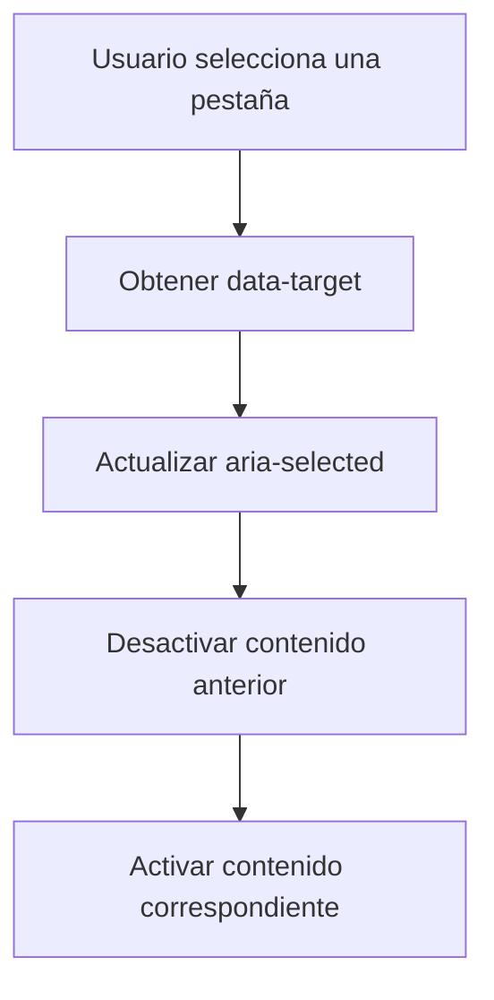
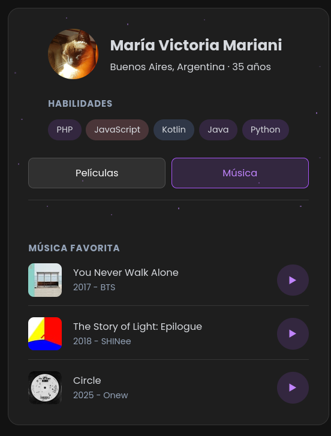
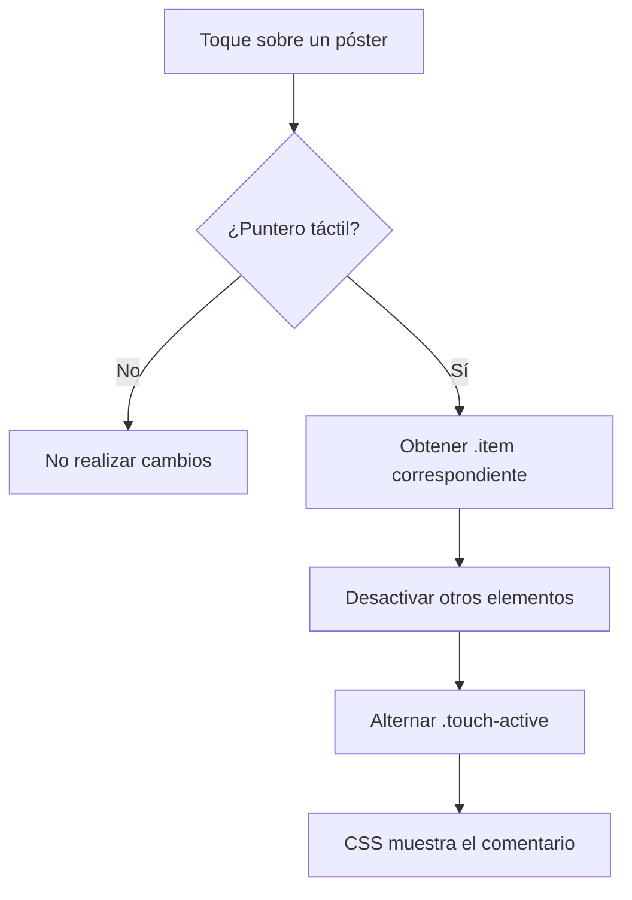
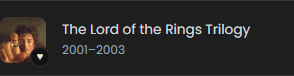
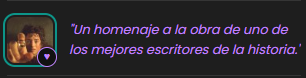
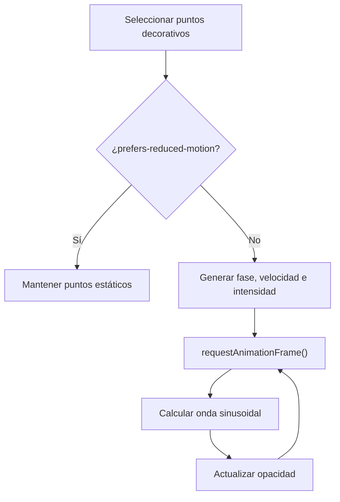

### Perfil individual (`perfil_victoria.html`)

El perfil individual utiliza JavaScript para gestionar las pestañas de contenido en dispositivos pequeños, adaptar determinadas interacciones al tipo de puntero disponible y controlar una animación decorativa. Estas funcionalidades se complementan con CSS para mantener separadas la lógica de interacción y la presentación visual.

#### 1. Pestañas de contenido en móvil

**Objetivo**

Permitir que las secciones de películas y música se presenten como pestañas en pantallas pequeñas, evitando mostrar simultáneamente todo el contenido disponible.

**Funcionamiento**

Los botones `.btn-tab` utilizan el atributo `data-target` para identificar la sección que deben mostrar.

Cuando el usuario selecciona una pestaña:

1. JavaScript obtiene el identificador almacenado en `data-target`.
2. Se desactiva la pestaña anterior.
3. Se establece `aria-selected="true"` en la pestaña seleccionada.
4. Se agrega la clase `.activo` al contenido correspondiente.
5. Las demás secciones pierden esa clase.

La funcionalidad se limita a pantallas menores de `801px`. En escritorio, las pestañas dejan de ser necesarias y ambas secciones permanecen visibles mediante CSS.

**Implementación técnica**

* `querySelectorAll(".btn-tab")` obtiene las pestañas disponibles.
* `data-target` permite relacionar cada botón con su contenido.
* `classList.toggle()` controla el estado visual de las pestañas y los paneles.
* `aria-selected` comunica cuál es la pestaña actualmente seleccionada.
* `window.innerWidth` permite limitar el comportamiento de las pestañas al diseño móvil.



**Responsive**

La presentación cambia según el ancho de pantalla:

* Hasta `800px`: las secciones funcionan mediante pestañas.
* Desde `801px`: las pestañas se ocultan y las secciones permanecen visibles simultáneamente.

De esta manera, JavaScript controla el estado de la interacción móvil mientras CSS determina la distribución visual de cada versión.



---

#### 2. Interacciones adaptadas al tipo de puntero

El perfil utiliza `window.matchMedia("(pointer: coarse)")` para detectar si el dispositivo dispone de un puntero táctil o poco preciso.

La consulta se guarda en `pointerQuery` para reutilizar el resultado en las diferentes interacciones, evitando repetir la creación de la media query en cada evento.

Esto permite diferenciar entre:

* **Punteros precisos:** como mouse o trackpad.
* **Punteros táctiles:** como pantallas táctiles.

La lógica de interacción se complementa con CSS mediante las media queries `pointer: fine` y `pointer: coarse`.

---

#### 3. Interacción táctil para películas y música

**Objetivo**

Adaptar la interacción de los pósters a dispositivos táctiles, donde no existe el comportamiento tradicional de `hover`.

Al tocar un póster, JavaScript agrega la clase `.touch-active` al elemento `.item` correspondiente.

CSS utiliza esa clase para:

* ocultar temporalmente la información inicial;
* mostrar el comentario asociado;
* actualizar el indicador visual del póster.

Solo un elemento puede permanecer activo simultáneamente. Antes de activar el elemento seleccionado, JavaScript elimina `.touch-active` de los demás elementos.



En dispositivos con puntero preciso, esta interacción no se ejecuta mediante JavaScript. El comportamiento equivalente se resuelve mediante CSS utilizando `:hover` para el mouse y `:focus-visible` para la navegación mediante teclado.

Los contenedores de los pósters utilizan `tabindex="0"` para permitir que puedan recibir foco durante la navegación con teclado. Al recibir foco, se muestra el comentario asociado y se mantiene un indicador visual de foco. De esta forma, la información complementaria no depende exclusivamente del uso del mouse.

En dispositivos táctiles, JavaScript utiliza la clase `.touch-active` para proporcionar un comportamiento equivalente mediante el toque.

Esto evita intentar reproducir mediante JavaScript una interacción que el navegador ya puede gestionar de forma adecuada en dispositivos con mouse o trackpad.





---

#### 4. Interacción táctil para las habilidades

Las habilidades utilizan un mecanismo similar al de los pósters.

Cada elemento de `.habilidades` puede recibir la clase `.touch-active` cuando se toca en un dispositivo con puntero táctil.

JavaScript garantiza que solamente una habilidad permanezca activa a la vez. CSS utiliza la clase para cambiar el fondo, el color y aplicar un pequeño escalado visual.

En dispositivos con puntero preciso, la misma interacción visual se obtiene mediante `:hover`, sin necesidad de JavaScript.

Esto permite mantener un comportamiento equivalente entre diferentes dispositivos utilizando el mecanismo de interacción apropiado para cada uno.

---

#### 5. Limpieza al cambiar el tipo de puntero

El objeto `pointerQuery` también permite detectar cambios en el tipo de puntero mediante el evento `change`.

Cuando el dispositivo deja de utilizar un puntero táctil, JavaScript elimina las clases `.touch-active` que hayan quedado activas.

De esta manera, los estados específicos de la interacción táctil no permanecen aplicados cuando el contexto de interacción cambia.

```js
pointerQuery.addEventListener("change", () => {
  if (!pointerQuery.matches) {
    document
      .querySelectorAll(".touch-active")
      .forEach((element) => {
        element.classList.remove("touch-active");
      });
  }
});
```

Este comportamiento mantiene consistente el estado visual cuando cambia dinámicamente el entorno de interacción.

---

#### 6. Animación decorativa de puntos

El perfil incluye una animación visual formada por pequeños puntos decorativos ubicados alrededor de la tarjeta.

Estos elementos están marcados con `aria-hidden="true"` porque cumplen únicamente una función estética y no aportan información necesaria para comprender el contenido del perfil.

JavaScript selecciona los puntos y genera para cada uno tres valores independientes:

* **Fase:** determina desde qué momento comienza su ciclo.
* **Velocidad:** determina la velocidad de la variación.
* **Intensidad:** determina el nivel máximo de opacidad.

Los valores se generan de forma aleatoria al cargar la página, evitando que todos los puntos se animen exactamente al mismo tiempo.

La animación utiliza `requestAnimationFrame()` para actualizar continuamente la opacidad de cada punto.



La opacidad se obtiene a partir de una función sinusoidal, lo que produce una variación progresiva en lugar de un cambio brusco entre visible e invisible.


---

#### 7. Respeto por `prefers-reduced-motion`

La animación decorativa comprueba la preferencia del usuario mediante:

```js
window.matchMedia("(prefers-reduced-motion: reduce)")
```

Cuando el usuario solicita reducir el movimiento, los puntos no ejecutan la animación y permanecen con una opacidad fija.

Esto permite conservar el elemento decorativo sin imponer una animación continua a usuarios que hayan indicado una preferencia por reducir el movimiento.

---

#### Separación entre JavaScript y CSS

Las interacciones del perfil se diseñaron separando la lógica de comportamiento de la presentación visual.

JavaScript se ocupa principalmente de:

* detectar el contexto de interacción;
* gestionar estados;
* responder a eventos;
* actualizar atributos de accesibilidad;
* activar y desactivar clases;
* controlar qué contenido se encuentra visible;
* ejecutar la animación decorativa.

CSS se ocupa principalmente de:

* mostrar u ocultar las pestañas;
* adaptar la distribución entre móvil y escritorio;
* definir los estados `.activo` y `.touch-active`;
* controlar las transiciones;
* aplicar los efectos visuales de hover y foco;
* definir la apariencia de la animación decorativa.

Esta separación permite cambiar la apariencia de las interacciones sin modificar la lógica que controla su funcionamiento.

#### Resumen de APIs y mecanismos utilizados

| Recurso                                     | Uso                                                                      |
| ------------------------------------------- | ------------------------------------------------------------------------ |
| `querySelectorAll()`                        | Selección de pestañas, medios, habilidades y elementos decorativos       |
| `addEventListener()`                        | Gestión de clicks y cambios en media queries                             |
| `classList.toggle()` / `classList.remove()` | Control de estados visuales                                              |
| `setAttribute()`                            | Actualización de `aria-selected`                                         |
| `dataset.target`                            | Asociación entre pestañas y paneles                                      |
| `matchMedia()`                              | Detección del tipo de puntero y preferencia de movimiento                |
| `innerWidth`                                | Determinación del comportamiento de las pestañas en móvil                |
| `requestAnimationFrame()`                   | Actualización fluida de la animación decorativa                          |
| `Math.sin()`                                | Generación de una variación progresiva de opacidad                       |
| `Math.random()`                             | Generación de parámetros independientes para cada punto                  |
| `prefers-reduced-motion`                    | Adaptación de la animación a las preferencias de accesibilidad           |
| `aria-selected`                             | Comunicación del estado de las pestañas a tecnologías de asistencia      |
| `aria-hidden`                               | Exclusión de elementos puramente decorativos de la información accesible |
