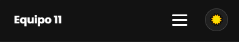
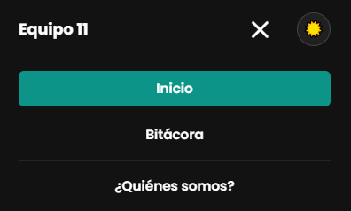
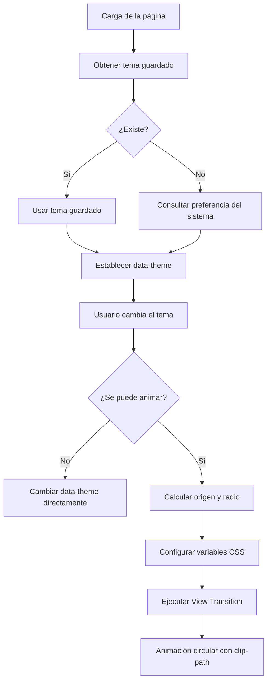
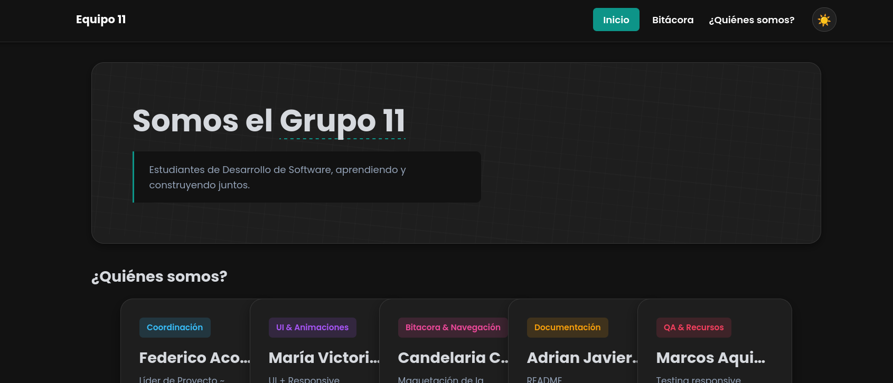
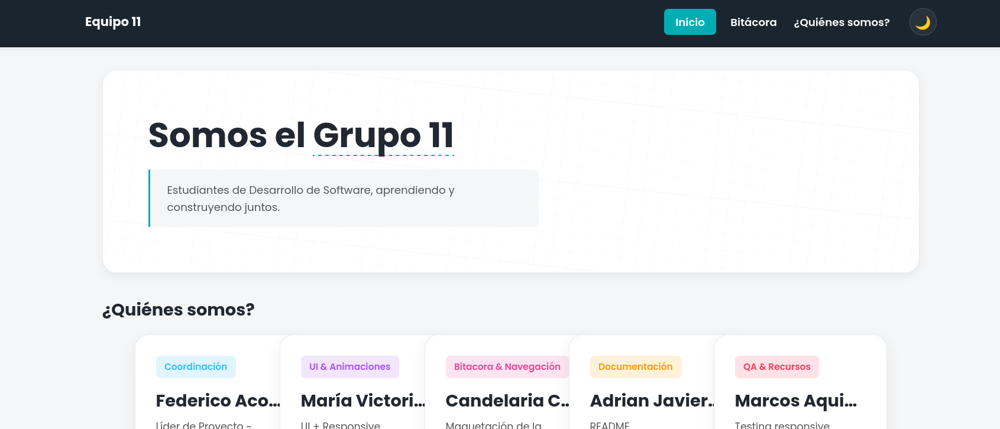
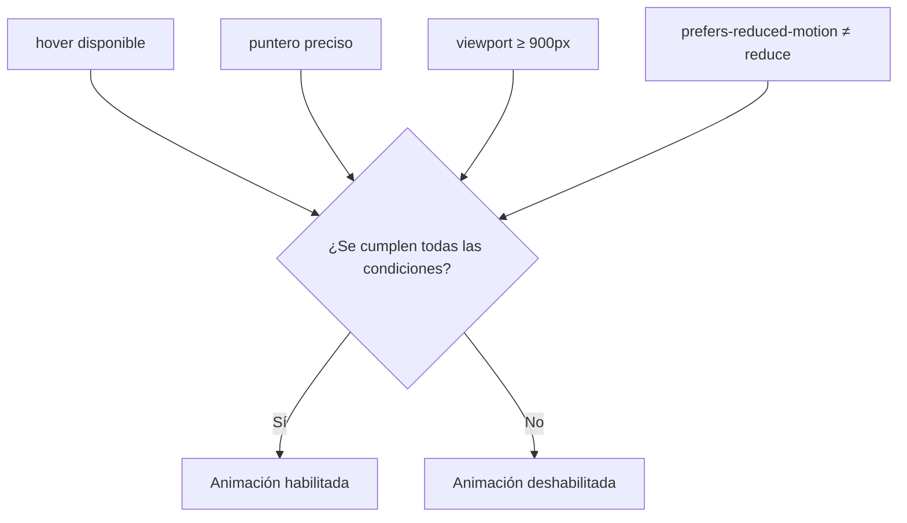
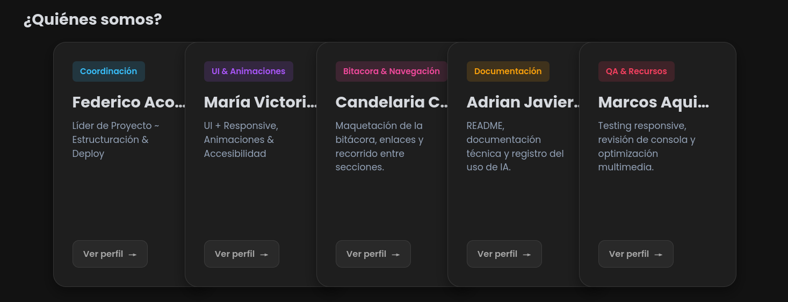

## Funcionalidades JavaScript

### Portada (`index.html`)

La portada utiliza JavaScript para gestionar la navegación responsive, el cambio de tema y una interacción visual sobre las tarjetas de integrantes. Las funcionalidades se implementaron considerando distintos dispositivos, preferencias de movimiento y compatibilidad del navegador.

#### 1. Menú responsive de navegación

**Objetivo**

Adaptar la navegación del sitio a pantallas pequeñas mediante un menú desplegable, manteniendo un estado accesible y consistente al cambiar entre dispositivos.

**Funcionamiento**

El botón `#menu-toggle` controla la apertura y el cierre del menú de navegación `#nav-list`. Al activarlo, JavaScript alterna las clases visuales necesarias y actualiza `aria-expanded` para representar el estado actual del menú.

Cuando el usuario selecciona un enlace, el menú se cierra automáticamente. También se controla el cambio entre mobile y escritorio mediante `window.matchMedia()`, restableciendo el estado del menú cuando la ventana alcanza el ancho definido para la navegación de escritorio.

**Implementación técnica**

* `addEventListener("click", ...)` gestiona la interacción con el botón y los enlaces.
* `classList.toggle()` permite alternar el estado visual del menú.
* `aria-expanded` se actualiza dinámicamente según el estado de apertura.
* `querySelectorAll("a")` permite registrar el cierre automático sobre los enlaces.
* `window.matchMedia("(min-width: 769px)")` permite detectar el cambio hacia el diseño de escritorio.
* Al cambiar de modo, se eliminan las clases de estado y se restablece `aria-expanded="false"`.

**Accesibilidad**

El estado del menú no se comunica únicamente mediante cambios visuales: `aria-expanded` permite que las tecnologías de asistencia conozcan si la navegación está abierta o cerrada.

**Responsive**

La funcionalidad está vinculada al comportamiento responsive del menú, pero la presentación visual se resuelve mediante CSS. JavaScript se encarga únicamente del estado y de mantenerlo consistente cuando cambia el tamaño de la ventana.





---

#### 2. Cambio de tema, persistencia y transición visual

**Objetivo**

Permitir que el usuario alterne entre los temas claro y oscuro, conservar su elección entre sesiones y proporcionar una transición visual sin impedir el funcionamiento en navegadores que no soporten la API utilizada.

**Funcionamiento**

Al presionar el botón `#theme-toggle`, JavaScript obtiene el valor actual del atributo `data-theme` y calcula el siguiente estado:



El nuevo valor se almacena en `localStorage` mediante la clave `theme`. De esta manera, la preferencia se recupera cuando el usuario vuelve a cargar la página.

El cambio de tema se realiza mediante el atributo `data-theme` del elemento raíz `<html>`. El CSS utiliza este atributo para aplicar los estilos correspondientes a cada modo.

**Persistencia del tema**

Durante la carga inicial se ejecuta un pequeño script inline que:

1. Busca una preferencia almacenada en `localStorage`.
2. Si no existe, consulta `prefers-color-scheme: dark`.
3. Establece el atributo `data-theme` durante la inicialización de la página.
4. Agrega temporalmente la clase `no-transiciones`.

La clase evita que las transiciones visuales se ejecuten durante la inicialización y reduce el efecto de parpadeo al cargar la página con un tema diferente al predeterminado.

**Transición mediante View Transitions API**

Cuando el navegador dispone de `document.startViewTransition()` y el usuario no tiene activada la preferencia `prefers-reduced-motion: reduce`, el cambio de tema utiliza la View Transitions API.

Antes de iniciar la transición, JavaScript obtiene las coordenadas del botón mediante `getBoundingClientRect()` y calcula un radio suficiente para cubrir toda la ventana:

```js
const rect = btnCambioTema.getBoundingClientRect();

const x = rect.left + rect.width / 2;
const y = rect.top + rect.height / 2;

const radioFinal = Math.hypot(
  Math.max(x, window.innerWidth - x),
  Math.max(y, window.innerHeight - y)
);
```

Las coordenadas y el radio se envían al CSS mediante propiedades personalizadas:

```text
--ripple-x
--ripple-y
--ripple-radius
```

El CSS utiliza esos valores con `clip-path: circle()` para realizar una transición circular cuyo origen coincide con la posición del botón de cambio de tema.




**Compatibilidad y accesibilidad**

La animación no es necesaria para que la funcionalidad pueda utilizarse. Si `View Transitions API` no está disponible, el tema cambia directamente.

También se consulta:

```js
window.matchMedia("(prefers-reduced-motion: reduce)")
```

Cuando el usuario solicita reducir el movimiento, se evita la animación y se realiza únicamente el cambio de tema.

Esto permite separar la funcionalidad principal —cambiar el tema— del efecto visual utilizado para presentarla.

---

#### 3. Efecto 3D interactivo de las tarjetas

**Objetivo**

Agregar una interacción visual a las tarjetas de integrantes mediante una inclinación 3D controlada por la posición del puntero y un desplazamiento diferencial de sus elementos internos.

**Funcionamiento**

Cuando el usuario mueve el puntero sobre una tarjeta, `manejarMovimiento()` obtiene:

* la tarjeta sobre la que se produjo el evento;
* sus dimensiones y posición mediante `getBoundingClientRect()`;
* la posición del puntero respecto del centro de la tarjeta.

La posición se normaliza para obtener valores aproximados entre `-1` y `1`:

```js
const posicionX = x / (rect.width / 2);
const posicionY = y / (rect.height / 2);
```

Estos valores se utilizan para calcular la inclinación:

```js
const rotateX = -posicionY * 8;
const rotateY = posicionX * 8;
```

La tarjeta recibe una transformación 3D mediante `perspective()`, `rotateX()` y `rotateY()`.

**Profundidad de los elementos**

La interacción no modifica únicamente la tarjeta. También se desplazan sus elementos internos a diferentes velocidades para crear una separación visual entre planos:

| Elemento  |           Desplazamiento |
| --------- | -----------------------: |
| Tarjeta   |              Rotación 3D |
| Contenido |   `10px` aproximadamente |
| Avatar    | `22.5px` aproximadamente |

El avatar recibe además una mayor profundidad mediante `translate3d(..., ..., 45px)`, mientras que el contenido utiliza una profundidad menor.

De esta forma, la posición del puntero controla simultáneamente la inclinación de la tarjeta y el desplazamiento de sus elementos internos.

**Restablecimiento**

Cuando el puntero abandona la tarjeta, `resetearAnimacion()` elimina las transformaciones aplicadas y devuelve la tarjeta, el contenido y el avatar a su estado original.

---

### Activación condicional de la animación

El efecto 3D no se ejecuta en todos los dispositivos. Antes de registrar los eventos de mouse, `permiteAnimacion()` verifica cutro condiciones:



La condición utilizada es:

```js
(hover: hover) and (pointer: fine) and (min-width: 900px)
```

Esto permite limitar la interacción a dispositivos donde el uso de mouse o un puntero preciso resulta apropiado y evita aplicar este comportamiento a interfaces táctiles.

Además, se consulta `prefers-reduced-motion` para respetar la configuración de accesibilidad del usuario.

**Gestión dinámica de listeners**

El estado de la animación se almacena en `animacionActiva`. La función `actualizarAnimacion()` compara las condiciones actuales con el estado anterior.

Si la animación debe activarse, se registran los eventos:

```text
mousemove → manejarMovimiento()
mouseleave → resetearAnimacion()
```

Si deja de estar disponible, `desactivarAnimacion()` elimina esos listeners y limpia las transformaciones existentes.

Los cambios se detectan mediante los eventos `change` de los objetos `MediaQueryList`, por lo que la funcionalidad puede adaptarse mientras el usuario redimensiona la ventana o modifica su preferencia de movimiento.




---

#### Consideraciones generales de implementación

Las funcionalidades de la portada se diseñaron separando la **lógica de interacción** de la **presentación visual**.

JavaScript se ocupa principalmente de:

* gestionar estados;
* responder a eventos del usuario;
* detectar características del dispositivo mediante `matchMedia()`;
* modificar atributos y clases;
* calcular valores dinámicos;
* registrar y eliminar listeners según el contexto.

CSS se ocupa de la presentación, las transformaciones y las animaciones visuales. Por ejemplo, JavaScript calcula las coordenadas y el radio de la transición del tema, mientras que CSS define mediante `@keyframes` y `clip-path` cómo se representa visualmente ese cambio.

Esta separación permite modificar la apariencia de las interacciones sin tener que modificar la lógica que controla su funcionamiento.

#### Resumen de APIs y mecanismos utilizados

| Recurso                                | Uso                                                                            |
| -------------------------------------- | ------------------------------------------------------------------------------ |
| `addEventListener()`                   | Gestión de eventos de usuario y cambios de media queries                       |
| `classList`                            | Control de estados visuales del menú                                           |
| `setAttribute()` / `removeAttribute()` | Gestión de atributos como `aria-expanded` y `data-theme`                       |
| `localStorage`                         | Persistencia de la preferencia de tema                                         |
| `matchMedia()`                         | Detección de viewport, capacidades de interacción y preferencias de movimiento |
| `getBoundingClientRect()`              | Obtención de posición y dimensiones de elementos                               |
| `View Transitions API`                 | Transición animada entre estados del tema                                      |
| `CSS Custom Properties`                | Comunicación de valores calculados por JavaScript hacia CSS                    |
| `transform` / `translate3d()`          | Movimiento y efecto de profundidad de las tarjetas                             |
| `prefers-reduced-motion`               | Adaptación de las animaciones a preferencias de accesibilidad                  |
